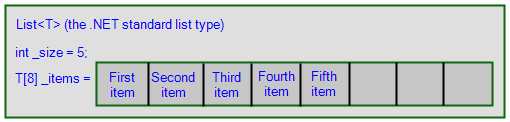
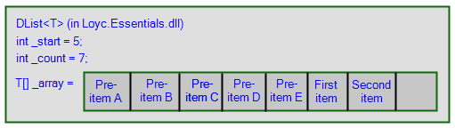
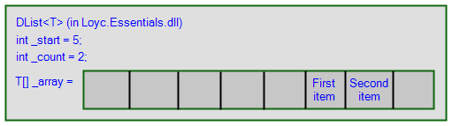
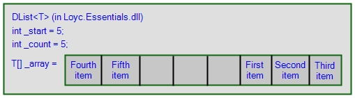

## DList<T>: The circular List<T>

Creating the `AList<T>` data structures for my list trifecta series must have taken hundreds of hours. The `DList<T>` is a vastly simpler beast, but may be able to boost your insert/remove speed a lot without adversely affecting the performance of other operations such as the indexer.

`DList<T>` is a "circular buffer". A circular buffer is a region of memory organized so that you can efficiently add or remove items at both ends, and is commonly used to implement queues (it's called a "circular queue").

The standard `List<T>`, pictured here, is an object that contains a reference to an array (`T[]`) and a "size" variable that indicates how many of the items of the array are currently in use:

The list also enlarges itself as you add items. The array starts at size 4, then enlarges to 8 when you add the fifth item, by creating a new array and copying the existing 4 items to the new array before adding the fifth.

In `List<T>`, the items that are in use are always aligned along the "left" side of the array (the beginning). If you remove the first item, the remaining items are all moved leftward, one by one. When the list is small, such an operation is very fast on modern hardware, but if the list is long enough and you perform enough insert/remove operations, the person using your program may start to notice.

## The `DList<T>`

I have created a similar class called `DList<T>`. It is just like `List<T>` except that it has an extra integer that keeps track of the "start location", which is the index of the "first" item in the list. 

The `D` in `DList` stands for "deque" or double-ended queue, since `DList` implements [`IDeque<T>`](/doc/code/interfaceLoyc_1_1Collections_1_1IDeque_3_01T_01_4.html) and is ideal as a double-ended queue. But its name is `DList` rather than `Deque` to emphasize the fact that it can also do everything that a normal `List<T>` can do.

At first, items are added to the left side of the array, in the same way as for `List<T>`. Suppose you add five items to a `DList<T>`, and then you add two more (seven in total):

If you then remove the first five items, the `_start` reference is advanced up to 5; there is no need to move any of the other items:

If you add 3 additional items to the end, there is certainly enough room in an array of 8 for the 3 new items, but the new items must "wrap around" to the beginning of the array:

From the outside, `DList<T>` appears to behave exactly like `List<T>`, but because `DList<T>` uses the so-called circular buffer concept, it is much faster in case you will be adding or removing items at the beginning, or near the beginning, of the list. Whenever you add or remove an item, `DList<T>` checks the distance from the beginning and end of the list and chooses the best insertion location. For example, if a `DList<T>` has 100,000 items and you insert something at index 40,000, the first 40,000 items will be moved left to make room for the new item, because it's slightly faster than the alternative of moving the last 60,000 items rightward.

Thus, inserting and removing items at random locations is almost twice as fast in a `DList<T>` compared to a `List<T>`, while inserting or removing items at the beginning or end is O(1), and inserting or removing items in the middle is the same speed. The disadvantage is that reading an item from a particular index is slightly more complicated. The index that you ask for must be "internalized" before it can be used:

    // Approximization. The real code is more...layered.
    public T this[int index]
    {
      get {
        if ((uint)index >= (uint)_count)
          throw new ArgumentOutOfRangeException(...);
        return _array[Internalize(index)];
      }
      Set {...}
    }
    int Internalize(int index)
    {
      index += _start;
      if (index >= _array.Length)
        return index - _array.Length;
      return index;
    }

On the plus side, you can avoid this small extra cost by enumerating with `foreach` instead of using the indexer.

For your convenience, `DList<T>` also has some extra stuff. It has `First`, `Last` and `IsEmpty` properties, there's a `Resize(int)` method which grows or shrinks the list to reach a certain size, and it has a `Slice(int start, int count)` method which returns a _view_ on a portion of the `DList`. As with slices of `AList<T>`, you can actually modify the `DList` through the slice; for example, this code...

    DList<int> list = new DList<int> { 0, 10, 20, 30, 40, 50, 60, 70, 80, 90 };
    ListSlice<int> slice = list.Slice(3, 4);
    for (int i = 0; i < slice.Count; i++)
        slice[i] = -1;

replaces items 30, 40, 50, and 60 with -1.

## `InternalDList<T>`

`InternalDList<T>` is a variation on `DList<T>` that is intended for use within other data structures. It is the same as `DList<T>` except for two things. First, it is a `struct` rather than a `class`, so it saves one heap allocation and 16 bytes of memory on a 64-bit machine. Second, it does not throw an exception if you ask for an index that is out of range; it checks the index with `Debug.Assert` instead.

Leaf nodes of `AList`s contain a single `InternalDList<T>` structure, to give leaf nodes the performance boost I was talking about. `DList<T>` itself also consists of a single `InternalDList<T>` structure (and nothing else).

