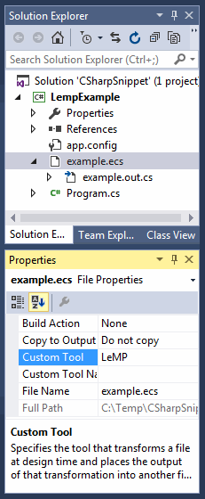

Introduction
------------

LeMP is a new open-source LISP-style macro processor, comparable to [sweet.js](http://sweetjs.org/) for Javascript. Are you a good developer, but reluctant to "buy into" commercial tools such as PostSharp to enhance your productivity? If so, LeMP will make you more productive.

Arguably, the use of certain design patterns, especially complex ones like the [Visitor Pattern](https://en.wikipedia.org/wiki/Visitor_pattern), or ones that require lots of boilerplate like [Decorator](https://en.wikipedia.org/wiki/Decorator_pattern), are actually indicators that the language being used isn't powerful enough. Many design patterns work by _convention_ rather than being encapsulated in a library or component, so they involve repetition and thus violate the DRY principle (don't repeat yourself).

A LISP-style macro processor helps you solve the **repetition-of-boilerplate** problem, and it also provides a framework in which you can run sophisticated algorithms at compile-time (for example, have a look at [LLLPG](http://www.codeproject.com/Articles/664785/A-New-Parser-Generator-for-Csharp), just one of many macros included with LeMP.)

Example: Simple data types
--------------------------

I like to create a lot of small data types, rather than using a few huge ones. And when you're making small data types, C# is annoying.

A simple type isn't hard:

	public class Person {
		public string Name;
		public DateTime DateOfBirth;
		public List<Person> SubItems;
	};

But there are limitations:

- There's no constructor, so you must always use property-initializer syntax to create one of these. That could get old fast.
- Since there's no constructor, you can't easily validate that valid values are used for the fields.
- Many of the best developers say you should make your fields read-only by default. And the style police say you should make them properties instead of fields.

So, you probably need a constructor. But adding a constructor is a pain!

	public class Person
	{
		public string Name           { get; private set; }
		public DateTime DateOfBirth  { get; private set; }
		public List<Person> Children { get; private set; }
		public Person(string name, DateTime dateOfBirth, List<Person> children)
		{ 
			Name = name;
			DateOfBirth = dateOfBirth;
			Children = children;
			// TODO: Add validation code
		}
	}

It's too much repetition!

- You repeat the class name twice.
- You repeat each data type twice.
- You repeat each property name twice.
- You repeat the name of each constructor parameter twice.
- You repeat "public" for each field.

LeMP solves these problems with a combination of (1) a macro, and (2) a little syntactical "makeover" of C#. In LeMP you'd write this:

	public class Person
	{
		public this(
			[prop] public string Name,
			[prop] public DateTime DateOfBirth,
			[prop] public List<Person> SubItems) {
			// TODO: Add validation code
		}
	};

Your output file will contain exactly the code listed above, and there is no repetition except for `[prop] public` (but you might not everything to be a public property anyway). Great! 

What's going on? In fact, there are three different macros working together:

1. To reduce repetition and ambiguity, Enhanced C# allows `this` as a constructor name (the [D language](http://dlang.org) has the same feature). A macro changes `this` into `Person`.
2. The second macro responds to the `prop` attribute by converting a field into a property. By default, it's a `{ get; private set; }` autoproperty. [INCOMPLETE]
3. A third macro is programmed to notice properties and visibility attributes (like `public`) on variables. When it notices one of those, it responds by transferring it out to the class, and putting a normal argument in the constructor. Finally, it adds a statement at the beginning of the constructor, to assign the value of the argument to the property or field.

Learn more
----------

Learn more about LeMP in these published articles:

- [Avoid tedious coding with LeMP, part 1](http://www.codeproject.com/Articles/995264/Avoid-tedious-coding-with-LeMP-Part)
- [Using LeMP as a C# code generator](lemp-code-gen-and-analysis.html)

Installation
------------

For now, please see the instructions in the [second article](http://www.codeproject.com/Articles/1081882/Using-LeMP-as-a-Csharp-code-generator).
