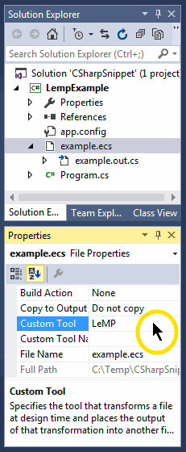

Introduction
------------

LeMP is a new open-source LISP-style macro processor for C#, comparable to [sweet.js](http://sweetjs.org/) for Javascript. Are you a good developer, but reluctant to "buy into" commercial tools such as PostSharp to enhance your productivity? If so, LeMP will make you more productive.

Design patterns are a valuable conceptual tool for developers, but some of them - especially complex ones like the [Visitor Pattern](https://en.wikipedia.org/wiki/Visitor_pattern), or ones that require lots of boilerplate like [Decorator](https://en.wikipedia.org/wiki/Decorator_pattern) - arguably demonstrate that the language being used isn't powerful enough. When used in conventional languages, many design patterns can _only_ work by convention and _cannot_ be encapsulated in a library or component, so they involve repetition and thus violate the DRY principle (don't repeat yourself).

A LISP-style macro processor helps you solve the **repetition-of-boilerplate** problem, and it also provides a framework in which you can run sophisticated algorithms at compile-time (for example, have a look at [LLLPG](http://www.codeproject.com/Articles/664785/A-New-Parser-Generator-for-Csharp), just one of many macros included with LeMP.)

Example: Making simple classes
------------------------------

It's not just design patterns. Any code pattern that involves unnecessary repetition is a sign of weakness in your programming language.

### Example: using ###

A really simple example is 'using' statements:

~~~csharp
using System;
using System.Linq;
using System.Text;
using System.Collections;
using System.Collections.Generic;
using System.IO;
using Loyc.Collections;
using Loyc.MiniTest;
using Loyc.Syntax;
~~~

Luckily, Visual Studio can add these for us. But wouldn't it be nice if half the screen wasn't 'using' statements every time you open a file? There is a LeMP macro that lets you collapse these onto a couple of lines:

~~~csharp
using System(.Linq, .Text, .Collections(, .Generic), .IO, );
using Loyc(.Collections, .MiniTest, .Syntax);
~~~

The comma `,` before the closing `)` adds an "empty" parameter to the list, which indicates that `using System` itself is one of the outputs you want to produce.

### Example: Small data types ###

I like to create a lot of small data types, rather than using a few huge ones. And when you're making small data types, C# is annoying. A simple type isn't hard:

~~~csharp
public class Person {
	public string Name;
	public DateTime DateOfBirth;
	public List<Person> SubItems;
};
~~~

But this simplicity has a big price:

- There's no constructor, so you must always use property-initializer syntax to create one of these. That could get old fast. And if you ever _add_ a constructor later, you might have to change every place where you created one of those types.
- Since there's no constructor, you can't easily validate that valid values are used for the fields, and none of your fields have mandatory initialization.
- Many of the best developers say you should make your fields read-only if possible. And the style police say you should make them properties instead of fields.

So, you probably need a constructor. But adding a constructor is a pain!

~~~csharp
public class Person
{
	public string Name           { get; private set; }
	public DateTime DateOfBirth  { get; private set; }
	public List<Person> Children { get; private set; }
	public Person(string name, DateTime dateOfBirth, List<Person> children)
	{ 
		Name = name;
		DateOfBirth = dateOfBirth;
		Children = children;
		// TODO: Add validation code
	}
}
~~~

It's too much repetition!

- You repeat the class name twice.
- You repeat each data type twice.
- You repeat each property name twice.
- You repeat the name of each constructor parameter twice.
- You repeat "public" for each field (and more, if they are properties)

LeMP solves these problems with a combination of (1) a macro, and (2) a little syntactical "makeover" of C#. In LeMP you'd write this:

~~~csharp
public class Person
{
	public this(
		public string Name           { get; private set; },
		public DateTime DateOfBirth  { get; private set; },
		public List<Person> SubItems { get; private set; })
	{
		// TODO: Add validation code
	}
};
~~~

Your output file will contain exactly the code listed above, and there is no repetition except for `public .. { get; private set; }` (but you might not want everything to be a public property anyway, and if you're using C# 6.0 / VS2015 you can drop the `private set` part). Great! 

What's going on? Enhanced C# includes two syntax changes to support this, each with a supporting macro:

1. To reduce repetition and ambiguity, Enhanced C# allows `this` as a constructor name (a feature borrowed from the [D language](http://dlang.org)). A macro changes `this` into `Person` so that plain C# understands it.
2. Enhanced C# allows property definitions as method parameters (or wherever an expression is allowed). A macro is programmed to notice properties, and visibility attributes (like `public`) on variables. When it notices one of those, it responds by transferring it out to the class, and putting a normal argument in the constructor. Finally, it adds a statement at the beginning of the constructor, to assign the value of the argument to the property or field.

Learn more
----------

Learn more about LeMP in these published articles:

- [Avoid tedious coding with LeMP, part 1](avoid-tedium-with-LeMP.html)
- [Using LeMP as a C# code generator](lemp-code-gen-and-analysis.html)
- [C# Gets Pattern Matching, Algebraic Data Types, Tuples and Ranges](lemp-pattern-matching.html)

Some use cases and built-in macros (such as `on_finally`, backing fields, and support for symbol literals) are not yet documented and I will be writing new articles about that in the coming days. Watch this space!

Download & Installation
-----------------------

Please visit the [installation page](install.html).

See also: [Version History](version-history.html)

Help wanted
-----------

Do you have time to [make LeMP better](help-wanted.html)? I can't pay you, since this is all non-profit. However, if you're an employer maybe you could [hire me](https://www.linkedin.com/in/qwertie) for consulting work. Seriously: if you don't hire me I might run out of things to do with C# soon, and then who's going to maintain LeMP? Sorry, I hope that didn't sound like a threat. Just sayin'.
