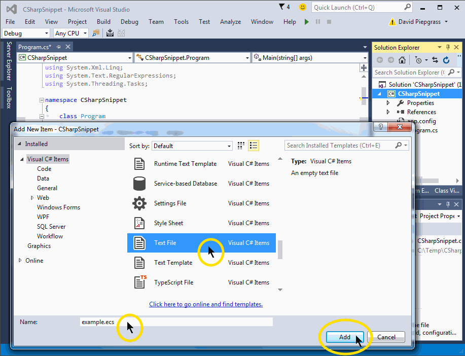
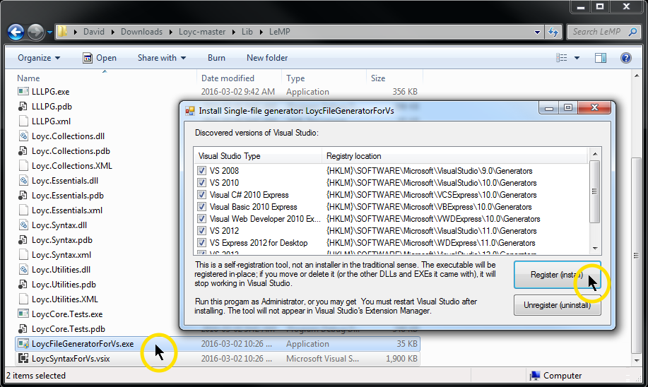
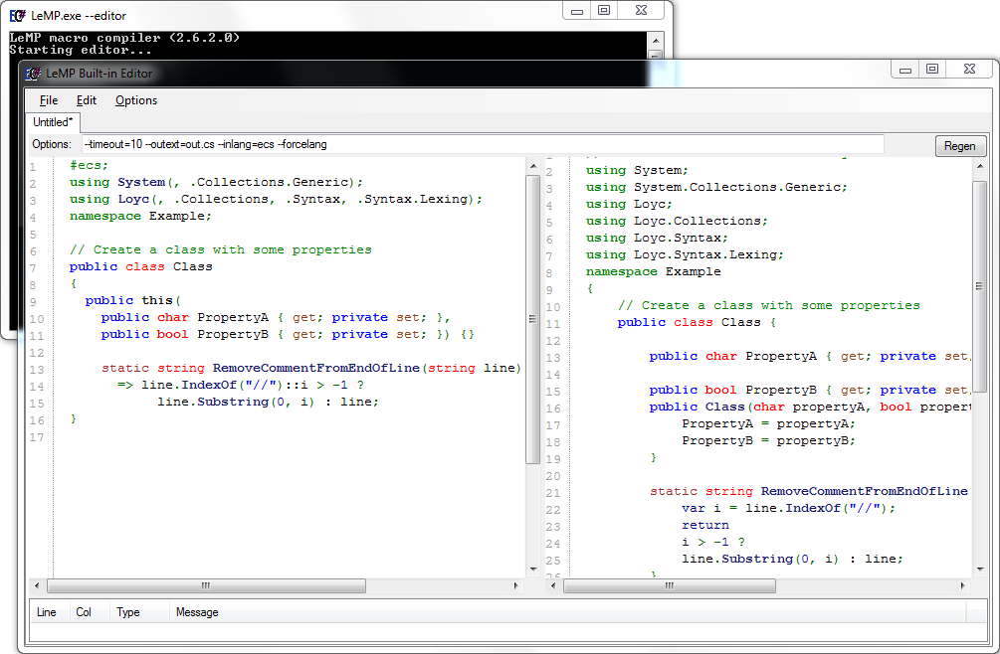

In Visual Studio
----------------

Installing LeMP in Visual Studio (2015/2017) is easy now: just download the vsix file from the [latest release](https://github.com/qwertie/ecsharp/releases), then open it and tell it to install. (Visual Studio 2008 through 2013 have a different install process; see below.)

**Note**: If you installed a previous version of LeMP, you must uninstall it from within Visual Studio first, because apparently vsix files don't support upgrades. Go to Tools \| Extensions and Updates and find the "LeMP Custom Tool" or "LoycSyntaxForVS" extension and then click uninstall. If your old version is called LoycSyntaxForVS, then you were using the old two-part install process, which means there is also a two-part uninstall process. In this case, the second part of the uninstallation is to find the LoycFileGeneratorForVs.exe file (it is located wherever you chose to put it). Run this file and click "Unregister (Uninstall)".

### Try it out

I typically add a .cs file to my project as usual, then change the extension to .ecs. The Enhanced C# syntax highlighter should take over, though IntelliSense will stop working. Alternately, you can create a text file and give it the .ecs extension in the first place, as shown here:

Then, open the *Properties* panel and change the *Custom Tool* option to **_LeMP_**. An output file called `example.out.cs` should appear under `example.ecs`.

Finally, add some Enhanced C# code to make sure it works, e.g.

~~~csharp
using System;
using System.Collections.Generic;
using System.Linq;
using System.Windows;

namespace Loyc.Ecs {
   class Person {
      public this(public readonly string Name, 
                  public int WeightLb, public int Age) {}
   }
}
~~~

Most features of LeMP (or [LLLPG](/lllpg)) do not have any runtime dependencies, but a few do. For example:

- [Code Contracts](http://ecsharp.net/lemp/ref-code-contracts.html) can be used with or without the [Microsoft Code Contracts](https://github.com/Microsoft/CodeContracts) extension.
- Symbol literals like `@@Hello` require the `Symbol` type from Loyc.Essentials.dll, which you can find via the NuGet package manager built into Visual Studio. You can also obtain Loyc DLLs from the zip file associated with the [latest release](https://github.com/qwertie/ecsharp/releases). This feature also requires the line `#ecs;` at the top of your file.
- The [`quote`](http://ecsharp.net/lemp/ref-other.html#quote) and [`matchCode`](http://ecsharp.net/lemp/ref-other.html#matchcode) macros require at least Loyc.Syntax.dll (which provides support for [LES](http://loyc.net/les) and [Loyc trees](http://loyc.net/loyc-trees)). Loyc.Syntax uses Loyc.Collections and Loyc.Essentials. You also need Loyc.Ecs.dll if you want to parse C# code or EC# code. Again, you can get these DLLs via NuGet.
- [LLLPG](http://ecsharp.net/lllpg) is typically used with Loyc.Syntax.dll, though it can also be used without external dependencies, [as explained in the LLLPG documentation](http://ecsharp.net/lllpg/5-loyc-libraries.html).

### Support for Visual Studio 2008 through 2015

v2.6.2 is the last version of LeMP to support these old versions of Visual Studio, and the only version that supports all versions from 2008 to 2017. For very esoteric reasons (long story short: blame Microsoft), there is a two-part installation process for older versions of Visual Studio. One part is the Single-File Generator (Custom Tool), and the other is the syntax highlighter.

So, download LeMP2.6.2.zip from its [release page](https://github.com/qwertie/ecsharp/releases/tag/v2.6.2) and unzip it.

Then, run `Lib\LeMP\LoycFileGeneratorForVs.exe` to install the LeMP & LLLPG Custom Tools (a.k.a. Single-File Generators). Make sure your version of Visual Studio is listed, and click Register (install).

**Note**: The custom tools run in-place; they are not copied anywhere else.

To install syntax highlighting for `.ecs` and `.les` files, run `LoycSyntaxForVs.vsix`. This extension supports Visual Studio 2010 through 2015 (not 2008).

On other platforms
------------------

All platforms support a command-line version of LeMP, LeMP.exe. Download the zip file from the [latest release](https://github.com/qwertie/ecsharp/releases) (e.g. LeMP2.6.2.zip) and unzip it.

That zip file contains LeMP.exe. You can run this file directly on Windows:

    LeMP your-source-code.ecs

But on other platforms you'll typically run it with [mono](http://www.mono-project.com):

    mono ./LeMP.exe your-source-code.ecs

LeMP also has a built-in editor to help you play with it. This editor is started from the command line with `LeMP.exe --editor`:

Okay, that's it. Good luck, have fun, and feel free to email me if you need help. I'm reachable via gmail.com, where my username is qwertie256.