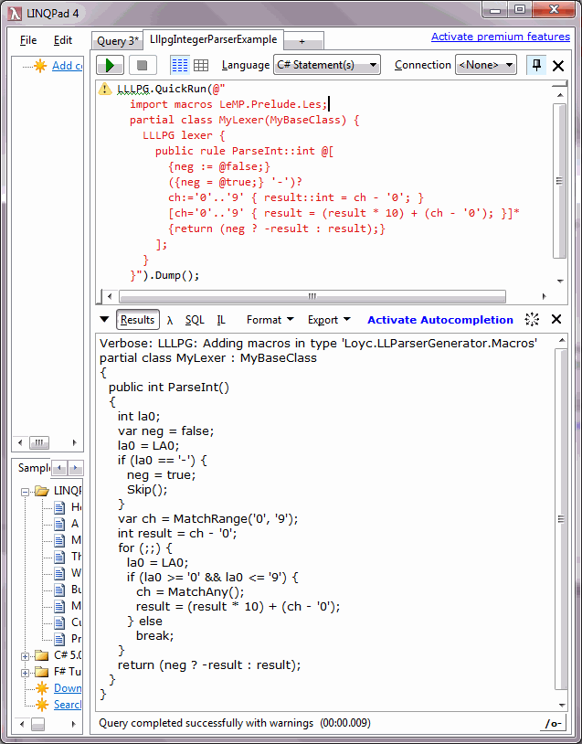
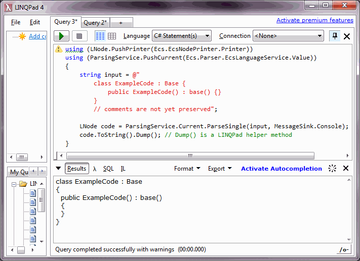

## Introduction

LLLPG (Loyc LL(k) Parser Generator) is a recursive-decent parser generator for C#, with a feature set slightly better than ANTLR version 2. LLLPG is now complete, and supports either Enhanced C# (EC#) or [Loyc Expression Syntax][2] (LES) as input languages.

In this article I assume you already know what [parsers][3] and [lexers][4] are; if not, click the links. In case you haven't written parsers before, [article #2](lllpg-part-2.html) will fill in your knowledge.

LLLPG is a system that I decided to create after trying to use [ANTLR3][5]'s C# module, and running into C#-specific bugs that I couldn't overcome. Besides, I wasn't happy with the ANTLR-generated code; I thought I could generate simpler and more efficient code. "How hard could it be to make an LL(k) parser generator?" I wondered. The answer: pretty damn hard, actually.

It took me a bit longer to make LLLPG than I intended (what, 5 years?), but... better late than never, right? While ANTLR has advanced some ways in that time period, it is still Java-centric, and I think the advantages of LLLPG still make it worth considering even if all the major C#-specific bugs in ANTLR have been fixed (I don't know if they have or not, but the C# version still lags behind the Java version).

There are multiple ways to run LLLPG: on the command line, with LLLPG.exe, in a [single-file generator][6] for Visual Studio, or programmatically, e.g. in [LINQPad][7]:

In the screenshot you'll notice that the input language is not C#, even though the output is. Later, I'll explain this bizarre fact.

LLLPG is not a dedicated tool the way ANTLR is. Instead, LLLPG is designed to be embedded inside another programming language. While you may use LLLPG similarly to other parser generators, it's really just a "macro" inside a programming language I'm making called Enhanced C# — one of a hundred macros that you might be using, and perhaps in the future you'll write a macro or two yourself.

As of 2016, Enhanced C# is incomplete; only two components of it are ready (the parser, and the macro runner which is called [LeMP (Lexical Macro Processor)](/lemp)). However, hopefully you'll find it fairly user-friendly and fun.

Other design elements of LLLPG include:

* **LL(k) with benefits.** There are several types of parser generators, e.g. LALR(1), PEG, LL(1), LL(k), and LL(*). Of these, I think PEG (Parsing Expression Grammars,  usually implemented with packrat parsers) and LL(k)/LL(*) (ANTLR 2 and ANTLR 3/4, respectively) are the most popular for writing new grammars today (some people also use regular expressions, but regexes are much less powerful than "proper" parser generators because they do not support full recursion). In addition to plain LL(k), LLLPG has a few extra, advanced features because some programming languages are difficult to express with an LL(k) grammar alone. LL(k) has two main advantages: potentially high performance (especially as k gets lower), and output that is relatively easy to understand. To be honest, ANTLR 3/4 is more powerful than LLLPG because the lookahead value `k` is unlimited, but unlimited lookahead is not free; if your goal is to write a fast parser, limiting yourself to LL(k) is something you might do anyway. In LLLPG, you can still do unlimited lookahead with a _zero-width assertion_, it's just not automatic; you have to ask for it.
* **Simple, concise output. Minimal runtime baggage.** LLLPG attempts to generate lightweight parsers, similar to what you would write by hand (slightly more verbose, but not bad). I haven't tried ANTLR 4, but LLLPG usually produces simpler output than ANTLR 3. Plus, unlike ANTLR, LLLPG is designed to not need a runtime library; it can get by with just a single base class (actually two in practice, one for lexers and one for parsers) that you can copy from me, or rewrite yourself, if you enjoy easy work.
* **Speed over beauty.** LLLPG tries to produce code that is easy-to-follow, but it selectively uses `goto` and `switch` statements to maximize performance.
* **Exception-free.** Last time I used ANTLR, it still relied on exceptions for backtracking. LLLPG does not; actually, it doesn't do backtracking at all except when you use syntactic predicates, which create special backtracking subparsers called "recognizers".
* **A focus on prediction.** LLLPG is designed to focus on one job and do it as well as possible: LL(k) prediction analysis. LLLPG doesn't try to do everything for you: it doesn't construct tokens, it doesn't create syntax trees. You're a programmer, and you already have a programming language; so I assume you know enough to design your own `Token` class and syntax tree classes. If I designed and built your syntax trees for you, I figure I'd just be increasing the learning curve: not only would you have to learn how to use LLLPG, you'd have to learn my class library too! No, LLLPG's main goal is to eliminate the most difficult and error-prone part of writing LL(k) parsers by hand: **figuring out which branch to take**, or which method to call. LLLPG still leaves you in charge of the rest. That said, I _have_ designed a universal syntax tree as part of the [Loyc project][9], called the [Loyc tree][10], but LLLPG is not oriented toward helping you use them (later, I may add features for that purpose). Even so, I hope you'll consider using Loyc trees. Internally, LLLPG's implementation uses them heavily.
* **Balanced between speed and power.** LLLPG supports LL(k), zero-width assertions, and other features that make it more powerful than [Coco/R][11] which only supports LL(1) directly. It is not as powerful as ANTLR, which supports LL(*) and beyond, but by writing LL(k) grammars rather than LL(*) grammars, you can theoretically get faster parsers. I can't compete with ANTLR on features; Terrance Parr has been writing ANTLR and its predecessor for almost 20 years now, I think. But, you probably don't _need_ all those advanced features; I believe the feature set I chose is powerful enough for all modern languages, although it doesn't make everything easy. The fact that I wrote the EC# parser in LLLPG is proof of its real-world value.

## "Blah, blah, blah! Show me this thing already!"

Okay, let's get started! Here's a really simple example (EC#):

    LLLPG (lexer) {
        public rule Digit @{ '0'..'9' };
        public rule Integer @{ Digit+ };
    };

And the output is:

    public void Digit()
    {
        MatchRange('0', '9');
    }
    public void Integer()
    {
        int la0;
        Digit();
        for (;;) {
          la0 = LA0;
          if (la0 >= '0' && la0 <= '9')
            Digit();
          else
            break;
        }
    }

That's it! So here's some relevant facts to learn at this point (I love bulleted lists, don't you? I wish people would use more of them!):

* First of all, to keep this example simple and brief I didn't bother with any "`using`" statements, and I didn't wrap this code in a `namespace` or a `class`. My little mini-language doesn't care; the output reflects the input, so the output will likewise not have any "`using`" statements and won't be wrapped in a `class` or a `namespace` either. Garbage in, garbage out. If you want the output to be wrapped in a class declaration, you have to wrap the input in a class declaration.
* The grammar must be wrapped in an `LLLPG` block. Use "`LLLPG (lexer)`" for a lexer and "`LLLPG (parser)`" for a parser. The difference between the two is the treatment of _terminals_ (characters or tokens):
    * Lexer mode understands only integer and character input, but is optimized for this input. It does not accept named constants, only literal numbers and characters, because it can't tell which number a name might refer to (**Edit**: there is now an `alias` statement for naming constants). This mode assumes -1 means EOF (end-of-file). Note that lookahead variables have type `int`, not `char`, because `char` cannot hold -1, the representation of EOF. Luckily, C# doesn't really mind (`char` converts to `int` implicitly, although not the other way around).
    * Parser mode does not understand numbers, only symbols. Theoretically, the parser mode could be used for lexers too; the main problem is that it does not understand the range operator `..`, so you'd have to write monstrosities like `'0'|'1'|'2'|'3'|'4'|'5'|'6'|'7'|'8'|'9'` instead of `'0'..'9'`. Yuck. Parser mode expects you to define a C# symbol called `EOF` that represents end-of-file. In parser mode, a symbol called `Foo` is assumed to be a terminal if there is no rule called `Foo`.
* Each rule gets converted into a method with the same name. Attributes on the rule, such as `public` or `unsafe` (why are you using unsafe in a parser, smarty pants?) are transferred to the output. Rules support a few attributes, such as [`FullLLk]`, that are understood by LLLPG itself and stripped out of the output. The `private` attribute has a special meaning, and will cause a slightly different interpretation than a rule that is not marked private.
* LLLPG expects you to define a property called `LA0` that returns the current input character; it also expects an `LA(int k)` method for other lookahead values. As an optimization, LLLPG caches LA0 in a variable (`la0`), in case LA0 is a virtual method call or something like that.
* The lexer mode expects a method called `MatchRange()` to exist (and both modes expect a series of `Match()` methods for matching particular characters or tokens). This method's job is to test whether the input character matches the specified range, and to emit an error message if not. On mismatch, you can throw an exception, print a message, or whatever suits you. On success,  `MatchRange()` should return the consumed character so that you can store it in a variable if you want.
* The `+` operator means "one or more of these". `Digit+` is exactly equivalent to `Digit Digit*`; the `*` means "zero or more of these", and the `*` operator is translated into a for-loop, as you can see in the output (as you probably know, `for (;;)` means "loop indefinitely"; it's equivalent to `while (true)`.)
* This example also demonstrates the main characteristic of LL(k) parsers: prediction. The `if (la0 >= '0' && la0 <= '9')` statement is performing a task called "prediction", which means, it is deciding which branch to take (`Digit`? or exit the loop?). It must reach across rules to do this: each rule requires an analysis of every other rule it calls, in addition to analysis inside the rule itself. In this case, `Integer` must be intimately familiar with the contents of `Digit`. Which is kind of romantic, when you think about it.
* The body of the rule is enclosed in `@{...};`. Why not just braces or something else? Because LLLPG is embedded inside another programming language, and it cannot change the syntax of the host language. The construct "`public rule Foo @{...};`" is actually parsed by EC# as a property declaration, except with `@{...}` instead of the usual `{...}`. The `@{...}` is something called a **token literal**, which is a list of tokens (actually a _tree_, which matches pairs of `( ) { } [ ]`). The EC# (or LES) parser gathers up all the tokens and stores them for later. After the entire source file is parsed, the macro processor gives LLLPG a chance to receive the token tree and transform it into something else. LLLPG it runs its _own independent parser_ to process the token tree. Finally, it replaces the `LLLPG` block with normal C# code that it generated. I'll explain this in more detail later.

## Another example

My next example is almost useful: a simple lexer.

    using System;

    enum TT { 
		Integer, Identifier, Operator
	}
    LLLPG (lexer) {
        private token Letter @{ ('a'..'z'|'A'..'Z') };
        private token Id  @{ (Letter|'_')
                             (Letter|'_'|'0'..'9')* };
        private token Int @{ '0'..'9'+ };
        private token Op  @{ '+'|'-'|'*'|'/' };
        public token TT Token @
          {  Op  {return TT.Operator;}
          |  Id  {return TT.Identifier;}
          |  Int {return TT.Integer;}
          };
    };

In this example, `using System` and the `enum` are completely standard C# code and it will be printed out unchanged (well, it'll be reformatted. Whitespaces and comments are not preserved.) The rest is a mixture of Enhanced C# and LLLPG code.

Unlike ANTLR, which generates text output and treats actions in braces `{...}` like plain text, LLLPG fully parses its input, and generates output in the form  of a Loyc tree, not text. An independent library is in charge of formatting that Loyc tree as C# code (I welcome volunteers to write output libraries for  other languages such as C++ and Java. You won't just be helping LLLPG itself, but the entire Loyc project! Let me know if you're interested.)

Here's the generated code:

    using System;
    enum TT
    {
        Integer, Identifier, Operator
    }
    void Letter()
    {
        Skip();
    }
    void Id()
    {
        int la0;
        la0 = LA0;
        if (la0 >= 'A' && la0 <= 'Z' || la0 >= 'a' && la0 <= 'z')
          Letter();
        else
          Match('_');
        for (;;) {
          la0 = LA0;
          if (la0 >= 'A' && la0 <= 'Z' || la0 >= 'a' && la0 <= 'z')
            Letter();
          else if (la0 == '_')
            Skip();
          else if (la0 >= '0' && la0 <= '9')
            Skip();
          else
            break;
        }
    }
    void Int()
    {
        int la0;
        MatchRange('0', '9');
        for (;;) {
          la0 = LA0;
          if (la0 >= '0' && la0 <= '9')
            Skip();
          else
            break;
        }
    }
    void Op()
    {
        Skip();
    }
    public TT Token()
    {
        int la0;
        la0 = LA0;
        switch (la0) {
        case '*':
        case '+':
        case '-':
        case '/':
          {
            Op();
            return TT.Operator;
          }
          break;
        default:
          if (la0 >= 'A' && la0 <= 'Z' || la0 == '_' ||
                    la0 >= 'a' && la0 <= 'z') {
            Id();
            return TT.Identifier;
          } else {
            Int();
            return TT.Integer;
          }
          break;
        }
    }

This example demonstrates some new things:

* Notice that the `Letter()` and `Op()` methods simply call  `Skip()`, which means "advance to the next input character". That's because LLLPG has analyzed the grammar and detected that in all the places where `Letter()` or `Op()` is called, the caller has already verified the input! So  `Letter()` and `Op()` don't have to check the input, it's already guaranteed to be correct. This is an optimization called _prematch analysis_. **Note**: For this optimization to work, the rule must be explicitly marked private; otherwise, LLLPG assumes that the rule could be called by code outside the grammar.
* Similarly, there are statements like `if (la0 == '_') Skip();` rather than `if (la0 == '_') Match('_');`. The user-supplied `Match(x)` method must check whether `LA0` matches `x`, but `Skip()` can skip the check.
* The `return` statements in braces are called _actions_. LLLPG parses all actions, but it's important to understand that LLLPG _does not understand them_. For example, I've used a `return` statement, but LLLPG does not understand what the `return` statement does, and it does not take it into account during its analysis of the grammar. In this case, the `return` statement returns from the method early, and LLLPG doesn't know that. But in this case, LLLPG doesn't _need_ to know that (because if it did know, it would generate the same output anyway), so it is safe to use a `return` statement. In more complicated situations, though, you might introduce a bug in your parser by doing unexpected control flow. So, be smart about it.
* Instead of `rule`, I used `token` instead. Actually, in this example there is no difference whatsoever between `rule` and `token`; both generate the same code. I guess this was the wrong time to introduce `token`, since I can't demonstrate the difference yet. Anyway, there's this "token" mode, and it's called `token` because it usually makes more sense to use it in lexers than parsers. But, er, you can use it in parsers too. I dunno, maybe it needs a new name.
* LLLPG uses a `switch` statement if it suspects the code could be more efficient that way. Here it used  `switch()` to match `Op()`. However, it tries to balance code size with speed. It does not use switch cases for `Id()` because it would need 53 "`case`" labels to match it (26 uppercase + 26 lowercase + `'_'`), which seems excessive.

## The LeMP processing model

If you're only interested in the parser generator, please skip this section, because right now I'd like to discuss the fancy technology that LLLPG is built on. In fact, you can skip most of the rest of the article and go straight to [part 2][12].

So here's the deal. I designed a language called Enhanced C#. It's supposed to be about 99.7% backward compatible with C#, and the parser is about 95% complete (LINQ support is missing, but C# 6 syntax is available.) There is no EC# compiler yet, but there is a _printer_; instead you use the parser + LeMP + printer and feed the output to the plain C# compiler. With a few lines of code, you can parse a block of EC# code and print it out again:

    using (LNode.PushPrinter(Ecs.EcsNodePrinter.Printer))
    using (ParsingService.PushCurrent(Ecs.Parser.EcsLanguageService.Value))
    {
        string input = @"{ your_code_here(Any_EC#_code_will_work); }";
        LNode code = ParsingService.Current.ParseSingle(input, MessageSink.Console);
        string output = code.ToString();
    }

Since EC# is a superset of C#, LLLPG is able to produce C# code by using the EC# printer, as long as it only uses the C# subset of the language.

Earlier you saw a screen shot of LINQPad in which the input to LLLPG was _LES code_. LES is not a programming language, it is just a _syntax_ and nothing else.  One of the core ideas of the [Loyc project][9] is to "modularize" programming languages into a series of re-usable components.  So instead of writing one big compiler for a language, a compiler is built by mixing and matching components. One of those components is the Loyc tree (the `LNode` class in `Loyc.Syntax.dll`). Another component is the LES parser (which is a text representation for Loyc trees). A third component is the EC# parser, a fourth component is the EC# printer, and a fifth component is LeMP, the macro processor.

### Macros

Macros are a fundamental feature of [LISP][23] that I am porting over to the wider world of non-LISP languages.

A macro (in the LISP sense, not in the C/C++ sense) is simply a method that takes a syntax tree as input, and produces another syntax tree as output. Here's an example of a macro:

    [LexicalMacro("Name::Type",
      "Defines a variable or field in the current scope.", "#::")]
    public static LNode ColonColon(LNode node, IMacroContext sink)
    {
        var a = node.Args;
        if (a.Count == 2) {
            LNode r = node.With(CodeSymbols.Var, a[1], a[0]);
            r.BaseStyle = NodeStyle.Statement;
            return r;
        }
        return null;
    }

This macro is part of the "LES Prelude class" for LeMP. Its job is to take a LES "variable declaration"  such as `x::Foo` and change it into a different tree that the C# language service understands: ``#var(Foo, x)``, which represents `Foo x;`.

The input, `x::Foo`, is represented as a call to `#::` with two arguments, `x` and `Foo`. `ColonColon()` is designed to transform the call to "`#::`". It checks that there are two arguments, and swaps them while changing the call target from `#::` to `S.Var`,  which is an alias for `#var`. The C# node printer considers `#var(type, name)` to represent a variable declaration, and prints it with the  more familiar syntax "`type name`".

The point is, LLLPG is defined as a "macro" that takes your `LLLPG (lexer) { ... }`; or `LLLPG (parser) { ... }`; statement as input, and returns another syntax tree that represents C# source code. As a macro, it can live in harmony with other macros like the `ColonColon` macro.

### Bootstrapping LLLPG

In order to allow LLLPG to support EC#, I needed a EC# parser. But how would I create a parser for EC#? Obviously, I wanted to use LLLPG to write the parser, but without any parser there was no easy way to submit a grammar to LLLPG! After writing the LLLPG core engine and the EC# printer, here's what I did to create the EC# parser:

1. I used C# operator overloading and helper methods as a rudimentary way to write LLLPG parsers in plain C# ([example test suite][14]).
2. Writing parsers this way is very clumsy, so I decided that I couldn't write the entire EC# parser this way. Instead, I designed a new language that is syntactically much simpler than EC#, called [LES][2]. This language would serve not only as the original input language for LLLPG, but as a general [syntax tree interchange format][15]—a way to represent syntax trees of any programming language: "xml for code".
3. I wrote a lexer and parser for LES by calling LLLPG programmatically in plain C# (operator overloading etc.)
4. I wrote the [`MacroProcessor][16]` (which I later named "LeMP", short for "Lexical Macro Processor") and a wrapper class called [`Compiler][17]` that provides the command-line interface. `MacroProcessor`'s job is to scan through a syntax tree looking for calls to "macros", which are source code transformers (more on that below). It calls those transformers recursively until there are no macro calls left in the code. Finally, ``Compiler`` prints the result as text.
5. I built a small "macro language" on top of LES which combines LeMP (the macro processor) with a set of small macros that makes LES look a lot like C#. The [macros][18] are designed to convert LES to C# (you can write C# syntax trees directly in LES, but they are a bit ugly.)
6. I wrote some [additional macros][19] that allow you to invoke LLLPG from within LES.
7. I hacked the LES parser to also be able to parse LLLPG code like `@{ a* | b }` in a derived class (a shameful abuse of "reusable code").
8. I wrote a lexer and [parser for LES in LES itself][20].
9. I published this article in (Oct 2013).
10. I wrote the lexer and [parser of EC# in LES][21], in the process uncovering a bunch of new bugs in LLLPG (which I fixed)
11. I added one extra macro to support LLLPG in EC#.
12. Finally, to test the EC# parser, I rewrote the [grammar of LLLPG in EC#][22].
13. I updated this article (Feb 2014).

At long last the bootstrapping is complete, so you can write LLLPG parsers in EC#!

## LLLPG's input languages: EC# & LES

### Enhanced C# (EC#)

As I mentioned, Enhanced C# is a language based on C# whose compiler doesn't exist yet (I'm looking for volunteers to help build the compiler, stay tuned.) The parser does exist, though, so I can talk about some of the new syntax that EC# supports. Actually there is quite a bit of new syntax in EC#; let me just tell you about the syntax that is relevant to LLLPG.

#### Token literals

    Loyc.Syntax.Lexing.TokenTree eightTokens = @{
        This token tree has eight children
        (specifically, six identifiers and two parentheses.
         The tokens inside the parentheses are children of the opening '('.)
    };

LLLPG is a "domain-specific language" or DSL, which means it's a special-purpose language (for creating parsers).

Token trees are a technique for allowing DSLs (Domain-Specific Languages) without any need for "dynamic syntax" in the host language. Unlike some "extensible" languages, EC# and LES do not have "extensible" parsers: you cannot add new syntax to them. However, EC# and LES do have _token literals_, which are collections of tokens. After a source file has been parsed, a macro can run its own parser on a token tree that is embedded in the larger syntax tree. That's what LLLPG does.

EC# allows token trees in any location where an expression is allowed. It also allows you to use a token tree instead of a method body, or instead of a property body. So when the EC# parser encounters statements like these:

    rule Bar @{ "Bar" };
    rule int Foo(int x) @{ 'F' 'o' 'o' {return x;} };

The parser actually sees these as property or method declarations. LLLPG's `ECSharpRule` macro then transforms them into a different form, shown here:

    #rule(void, Foo, (), "Bar");
    #rule(int, Foo, (#var(int, x),), ('F', 'o', 'o', { return x; }));

The main LLLPG macro is in charge of turning this into the final output:

    void Bar()
    {
      Match('B');
      Match('a');
      Match('r');
    }
    int Foo(int x)
    {
      Match('F');
      Match('o');
      Match('o');
      return x;
    }

**Note**: you may also see token literals with square brackets `@[...]`. This means the same thing as `@{...}`; there are two syntaxes for a historical reason, as explained in the next article.

#### Block-call statements

    get { return _foo; }
    set { _foo = value; }

In C#, you may have noticed that "get" and "set" are not keywords. Not unless they are inside a property declaration, that is. In C#, they "become" keywords based on their location.

EC# generalizes this concept. In EC#, `get` and `set` are _never_ keywords no matter where they appear. Instead, `get {...}` and `set {...}` are merely examples of a new kind of statement, the _block-call statement_, which has two forms:

    identifier { statements; }                  identifier (argument, list) { statements; }

These statements are considered exactly equivalent to method calls of the following form:

    identifier({ statements; });                 identifier(argument, list, { statements; });

So the LLLPG block:

    LLLPG (parser(laType(TokenType), matchType(int))) {
       rule Foo @{ ... };
    }

Is a block-call statement, equivalent to

    LLLPG (parser(laType(TokenType), matchType(int)), {
       rule Foo @{...};
    });

#### Blocks as expressions

    string fraction = "0.155";
    float percent = 100 * { if (!float.TryParse(fraction, out float tmp)) tmp = -1; tmp };

In EC#, `{braced blocks}` can be used as expressions, which explains what a method call like `foo(x, { y(z) })` means. When a block is used inside an expression, like this, the final statement in the block becomes the return value of the block as a whole, when there is no semicolon on the end of the final statement. In this case, `tmp` is the result of the block, so `percent` will be set to `15.5`. Or rather, it _will_ be set to `15.5` after the EC# compiler is written. Until then, this is merely an interesting but useless syntax tree.

In the case of a statement like

    LLLPG (parser(laType(TokenType), matchType(int)), { rule Foo @{...}; });

Everything in parenthesis is passed to a macro belonging to LLLPG, which (to make a long story short) transforms it into C# code.

That's enough information to understand how LLLPG works. Hopefully now you understand the concept of LLLPG as a DSL embedded in EC#.

### Loyc Expression Syntax (LES)

LES is very comparable to EC#, especially its lexer (e.g. `"strings"`, `'c'`haracters, and `@identifiers` are practically the same between the two languages). It has

* Token literals `@{...}`
* Blocks as expressions
* Superexpressions, which serve a similar function as block-call statements in EC#, and are also used to represent `def` method declarations, `if` statements, `for` loops, `rule`s and virtually all other "special" syntax.

**Important:** All LES-based parsers now need to have the following first line:

    import macros LeMP.Prelude.Les;

Originally this was not required because the LES "prelude" macros were imported automatically. However, the LES prelude could potentially interfere with normal C# code, so it is no longer imported automatically (the macro compiler doesn't know anything about the input language, so it is unaware of whether it should import the macros or not).

When LLLPG was first released, you had to use LES, so I wrote the following section which describes the relationship between LES code and C# code. If you want, you can still write parsers in LES, but of course most readers will prefer EC#. If you are using "LeMP" instead of "LLLPG" as your single-file generator, add the line

    import macros Loyc.LLPG;

at the top of your file to gain access to LLLPG.

### Differences & similarities between LeMP/LES and C#

I don't want to bore you with all the details, but the most striking difference between LES and C# is that LES has _no keywords whatsoever_.  Words like `if` and `while` are not parsed in a special way because of the actual word used, but because of the _how the statement is formatted_.

Anyway, here's a list:

#### Similarities:

The following statements mean the same thing in LeMP/LES and C#:

    return;
    return x;
    continue;
    break;
    var x = value;                  x = y++ * 10;                                   Console.Write("Hi");

#### Differences:

In many cases the difference is simply that you need an extra semicolon or braces.

    using System.Collections.Generic;  import System.Collections.Generic;
    class Foo {   public Foo() : this(0) { }
      public Foo(int num) { }
    }
    class Foo {   public cons Foo() { this(0); };
      public cons Foo(num::int) { };
    };

    class Foo : BaseClass, IEnumerable { }  class Foo(BaseClass, IEnumerable!object) { };
    int Square(int x)       { return x*x; }  def Square(x::int)::int { return x*x; };
    void Quit() { throw new QuitException(); }    def Quit()  { throw (new QuitException()); };
    int x, y; string s;                 x::int; y::int; s::string;
    int[] list1;      List list2;  list1::array!int; list2::List!int;
    int? maybe = null;       bool flag = true;
    maybe::opt!int = @null;  flag::bool = @true;

    int more = (int)(num * 1.5);
    more::int = (num * 1.5) -> int;

    while (x) Foo();      while (x) { Foo(); }; while x   { Foo(); };
    do x/=2; while (x>y);     do { x/=2; } while (x>y);
    for (x = 0; x < 10; x++) Console.WriteLine(x);      for (x = 0, x < 10, x++) { Console.WriteLine(x); };
    foreach (var item in list) { Process(item); }  foreach (item in list)    { Process(item); };
    if (c) return 0;      if (c) { return 0; }; if c   { return 0; };
    if (list.Count > 0) str.Append(list[i]);         unless list.Count == 0 { str.Append(list[i]); };
    if (inc) x++; else x--;      if (inc) {x++;} else {x--;}; if inc   {x++;} else {x--;};
    switch (x) { case 123: break; default: break; }          switch (x) { case 123; break; default; break };          switch (x) { case 123 { break; }; default { break; }; };
    try { } catch (Exception ex) { } finally { }; try { } catch ex::Exception  { } finally { };

In fact, in many of these cases the braces are not actually required, but you should include them as long as you don't fully understand how LES works. Many error messages that don't mention  a semicolon are actually referring to a missing semicolon; LeMP gets confused because code like

    if (a) { ... } if (b) { ... }

is parsed successfully as a _single_ statement `if (a, {...}, if, b, {...})`, which the "if" macro does not understand because there are too many arguments.

## Wrapping up

Obviously, I've just scratched the surface here, but this is almost enough for an introduction. As a next step, you can try out the demo lexer and parser included with this article.

The bug in the [SFG][6] custom tool (LllpgForVisualStudio.exe 1.0) that involved this weird exception courtesy Microsoft:

> `InvalidCastException`: Unable to cast COM object of type '`System.__ComObject`' to interface type '`Microsoft.VisualStudio.Shell.Interop.IVsGeneratorProgress`'. This operation failed because the QueryInterface call on the COM component for the interface with IID '`{BED89B98-6EC9-43CB-B0A8-41D6E2D6669D}`' failed due to the following error: No such interface supported (Exception from HRESULT: 0x80004002 (E_NOINTERFACE)).

has been fixed in 1.1.0, so error messages will appear in the normal error list instead of on message boxes.

For more articles about LLLPG, return to the [home page](http://loyc.net/lllpg). Here's a list of topics that are covered in future articles:

* **What does LL(k) mean, anyway?**
* **Requirements on the base class** ([BaseLexer][27] and [BaseParser][28]).
* **Setting lookahead**: By default, the k in LL(k) is 2: LLLPG makes decisions on at most 2 characters or tokens of lookahead.  Use the [`k(4)]` rule attribute to allow 4 characters of lookahead instead (or the [`DefaultK(4)]` attribute on the whole grammar,  i.e., the `LLLPG` statement). In ambiguous grammars, raising k will enlarge the output size at an alarming rate. Please k responsibly.
* **Managing ambiguity**: most computer languages are actually somewhat ambiguous. LLLPG will first detect ambiguity and warn  you about it using an example of an ambiguous input ("Alternatives (2, 4) are ambiguous for input such as «0x_»"). Branches are specified in priority order,  and you can suppress warnings by separating branches with `/` (which works the same way as `|`, but slanted). In case of ambiguity with the exit branch,  you can use "`greedy`" or "`nongreedy`" to specify whether looping or exiting, respectively, should have higher priority.
* **Actions**, denoted `{code;}`, are code snippets inserted into the parser. Actually there's not much to say about them.
* **The set-inversion operator `~` **: If `TT.Foo` refers to a token type, `~TT.Foo` matches any single token except `TT.Foo`.
* **Saving inputs**: The value of a terminal can be assigned to a variable using `x:='a'..'z'` to create a variable `x`, `x='a'..'z'` to assign the value  to an existing variable `x`, or `xs+='a'..'z'` to add the value to a list '`xs`' by calling `list.Add(MatchRange('a', 'z'))`.
* **Error handling**: By default, LLLPG generates prediction code with the assumption the input is always well-formed. But there are a couple of ways  to handle errors, including an "error branch" as in `(a | b | error { HandleError(); })`, and the [`NoDefaultArm]` grammar attribute. Alternatively,  you can designate one branch as the default (the _default_ default branch is the last branch or the exit branch.)
* **Real LL(k)**: LLLPG doesn't use "real" LL(k) by default, it uses a slightly weaker prediction system that resembles Terrance Parr's  "[Linear Approximate Lookahead][29]", except that my version is a bit more powerful. Sometimes my pseudo-LL(k) isn't quite powerful enough, so you can add the experimental [`FullLLk]` attribute to your grammar  or to an individual rule, which causes "real" LL(k) to be used.
* **Semantic predicates**, denoted `&{expr}`, which are used for disambiguation. If two branches are ambiguous, you can use a semantic predicate  to put a condition on one or both branches that will be used to disambiguate; `expr` is simply a C# expression (or LES expression, if the input file is LES).
* **Syntactic predicates**, a.k.a. **zero-width assertions**, denoted `&(foo)`, are very similar, except that instead of running  a C# expression, LLLPG tests whether the input matches the syntax `foo`. Syntactic predicates can perform unlimited lookahead, so you can use them to escape  the limitations of LL(k) grammars.
* In LLLPG, loops (`foo*`), optional elements (`foo?`) and branches (`a|b|c`) are all instances of a single core predicate called Alts.  LLLPG treats the loop and branch arms in `(a|b|c)*` as a single unit.
* **Gates**, denoted `p => m`, separates "prediction" from "matching". Basically it is used to make LLLPG behave irrationally,  and you'll rightly feel proud of yourself if you can find a legitimate use for it. `=>` has higher precedence than `|`; `a | b => c | d` is parsed `a | (b => c) | d`.
* **All about Loyc and its libraries**.

So that's it! Hope you like my parser generator, folks, and I'll be happy to answer your questions. But you probably don't have questions. Because I pretty much covered everything.

## History

* Oct 7, 2013: LLLPG 0.9 released with this article
* Nov 19, 2013: Updated LLLPG to 0.91. Updated demo to be a bit cleaner and to eliminate dependencies on Loyc libraries. LLLPG 0.91 contains some bug fixes, a new `alias(X = Y)` command, and eliminates the dependency on `IntSet`. Visual Studio extensions coming soon...
* Nov 26, 2013: [Part 2 published][12] with Visual Studio extensions.
* Feb 8, 2014: LLLPG 1.0 released with EC# support; demo and article updated. Demo now uses EC# by default (LES version still included) and supports "mathy" expressions such as 2(2 + 5) => 14\.
* Feb. 23, 2014: [Part 3][30] published with LLLPG 1.1.0 and multiple new demos.
* Feb. 25, 2014: [Part 4][26] published.

[1]: http://www.codeproject.com/KB/recipes/664785/LLLPG.png
[2]: https://github.com/qwertie/LoycCore/wiki/Loyc-Expression-Syntax
[3]: http://en.wikipedia.org/wiki/Parsing
[4]: http://en.wikipedia.org/wiki/Lexical_analysis
[5]: http://www.antlr.org/
[6]: http://www.codeproject.com/Articles/686405/Writing-a-Single-File-Generator
[7]: http://www.linqpad.net/
[9]: http://loyc.net
[10]: https://github.com/qwertie/LoycCore/wiki/Loyc-trees
[11]: http://www.ssw.uni-linz.ac.at/coco/
[12]: http://www.codeproject.com/Articles/688152/The-Loyc-LL-k-Parser-Generator-Part-2
[14]: http://sourceforge.net/p/loyc/code/HEAD/tree/Src/LLLPG/Tests/LlpgCoreTests.cs
[15]: http://lambda-the-ultimate.org/node/4836
[16]: http://sourceforge.net/p/loyc/code/HEAD/tree/Src/LEL/MacroProcessor.cs
[17]: http://sourceforge.net/p/loyc/code/HEAD/tree/Src/LEL/Compiler.cs
[18]: http://sourceforge.net/p/loyc/code/HEAD/tree/Src/LEL/Prelude1.cs
[19]: http://sourceforge.net/p/loyc/code/HEAD/tree/Src/LLLPG/ParsersAndMacros/Macros.cs
[20]: http://sourceforge.net/p/loyc/code/HEAD/tree/Src/Loyc.Syntax/LES/LesParserGrammar.les
[21]: http://sourceforge.net/p/loyc/code/HEAD/tree/Src/Ecs/Parser/EcsParserGrammar.les
[22]: http://sourceforge.net/p/loyc/code/HEAD/tree/Src/LLLPG/ParsersAndMacros/StageOneParserGrammar.ecs
[23]: http://en.wikipedia.org/wiki/Lisp_(programming_language)
[24]: http://www.codeproject.com/Articles/688152/The-Loyc-LL-k-Parser-Generator-Part-2-2
[25]: http://www.codeproject.com/Articles/732222/The-Loyc-LL-k-Parser-Generator-Part-3-2
[26]: http://www.codeproject.com/Articles/733426/The-Loyc-LL-k-Parser-Generator-Part-4
[27]: http://sourceforge.net/p/loyc/code/HEAD/tree/Src/Syntax/Lexing/BaseLexer.cs
[28]: http://sourceforge.net/p/loyc/code/HEAD/tree/Src/Syntax/BaseParser.cs
[29]: http://www.antlr3.org/doc/glossary.html#Linear_approximate_lookahead
[30]: http://www.codeproject.com/Articles/732222/The-Loyc-LL-k-Parser-Generator-Part-3
[31]: http://www.codeproject.com/Articles/1002541/The-Loyc-LL-k-Parser-Generator-Part  