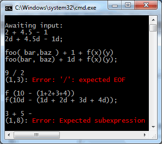

# This page is obsolete # 

The [LLLPG manual](/lllpg) has been reorganized. These old articles may be deleted in the future.

Welcome to part 3
-----------------

_New to LLLPG? Start at [part 1](http://www.codeproject.com/Articles/664785/A-New-Parser-Generator-for-Csharp)._

There are lots of things left to cover, so let's get started. LLLPG 1.1.0 was released at the same time as this article; much has changed since then, so this article was mostly rewritten in May 2016. For more detailed info about LLLPG's newest features, see [Part 5](lllpg-part-5.html).

A brief overview of the Loyc libraries
--------------------------------------

When writing a parser, you have to decide whether you'll use the Loyc runtime libraries or not; the main advantage of _not_ using them is that you won't have to distribute the 3 Loyc DLLs with your application. But they contain a lot of useful stuff, so have a look and see if you like them.

The important library for parsers based on LLLPG is _Loyc.Syntax.dll_, which depends on _Loyc.Essentials.dll_ and _Loyc.Collections.dll_. These DLLs have documentation for most of the classes they contain, automatically available to VS IntelliSense through _Loyc.Syntax.xml_, _Loyc.Essentials.xml_ and _Loyc.Collections.xml_.

In brief, let me just say very briefly what these libraries are for and what they contain.

**Loyc.Essentials.dll** is a library of general-purpose code that supplements the .NET BCL (standard libraries). It contains the following categories of stuff:

- Collection stuff: interfaces, adapters, helper classes, base classes, extension methods, and implementations for simple "core" collections such as [InternalList](http://core.loyc.net/collections/internal-list.html). You can [learn more in the docs](http://ecsharp.net/doc/code/namespaceLoyc_1_1Collections.html), but note that the documentation also shows the collections from Loyc.Collections.dll since it's all in the same namespace, `Loyc.Collections`.
- Geometry: simple generic geometric interfaces and classes, e.g. `Point<T>` and `Vector<T>`
- Math: generic math interfaces that allow arithmetic to be performed in generic code. Also includes fixed-point types, 128-bit integer math, and handy extra math functions in `MathEx`.
- Other utilities: message sinks ([`IMessageSink`](http://ecsharp.net/doc/code/interfaceLoyc_1_1IMessageSink.html)), [`Symbol`](http://ecsharp.net/doc/code/classLoyc_1_1Symbol.html), threading stuff, a miniture clone of NUnit ([`MiniTest`](https://github.com/qwertie/ecsharp/blob/master/Core/Loyc.Essentials/Utilities/MiniTest.cs), [`RunTests`](http://ecsharp.net/doc/code/classLoyc_1_1MiniTest_1_1RunTests.html)), and miscellaneous ["global" functions] and extension methods.
`Compatibility`: a very small amount of .NET 4.5 stuff, backported to .NET 4.0 when using the .NET 4 build.

Loyc.Essentials also defines [`ICharSource`](http://ecsharp.net/doc/code/interfaceLoyc_1_1Collections_1_1ICharSource.html) (defined in Loyc.Essentials.dll), a standard interface for a source of characters, which is used by lexers. `string` converts implicitly to [`UString`](http://ecsharp.net/doc/code/structLoyc_1_1UString.html) which is a string slice structure that implements `ICharSource`. The `Slice(start, count)` extension method can also get slices of strings.

[`IMessageSink`](http://sourceforge.net/p/loyc/code/HEAD/tree/Src/Loyc.Essentials/Utilities/IMessageSink.cs) serves as a simple, generic logging interface. It is recommended that your parsers report warnings and errors to an `IMessageSink` object. You can use `MessageSink.Console` to print (colored) errors to the console, `MessageSink.Null` to suppress output, and `MessageSink.FromDelegate((type, context, message, args) => {...})` to customize error handling.

The [`ParseHelpers` class](http://ecsharp.net/doc/code/classLoyc_1_1Syntax_1_1ParseHelpers.html) has generic number parsers that are handy for lexers, such as `TryParseDouble`, which can parse numbers of any reasonable radix and is therefore useful for hex float literals such as `0xF.Fp+1` (a syntax that represents 31.875).

**Loyc.Collections.dll** is a library of data structures, mostly rather complex ones, currently all written by me:

- [VLists](http://www.codeproject.com/Articles/26171/VList-data-structures-in-C): this data structure is notable because Loyc nodes (`LNode`s) use `VList<LNode>` for their arguments and attributes. This is an implementation detail that ideally you wouldn't have to know about; but C# has no [`typedef`s](http://en.wikipedia.org/wiki/Typedef) that I could use to hide the type, and since VLists are `struct`s, if you treat them as `IList<T>` they will be boxed, and you don't really want that.
- [ALists](http://core.loyc.net/collections/alists-part1.html), including the B+tree-like data structures `BList<T>`, `BDictionary<K,V>`, and my favorite, `BMultiMap<K,V>`, plus the new [`SparseAList<T>`](http://core.loyc.net/collections/alists-part3.html) which I use in my syntax highlighter.
- [`Bijection<K1,K2>`](http://ecsharp.net/doc/code/classLoyc_1_1Collections_1_1Bijection_3_01K1_00_01K2_01_4.html): A dictionary that goes in both directions.
- [And more!](http://core.loyc.net/collections/)

**Loyc.Syntax.dll** provides the foundations for LLLPG and contains the reference implementation of [LES, the syntax tree interchange format](http://loyc.net/les):

- [`BaseLexer`](http://ecsharp.net/doc/code/classLoyc_1_1Syntax_1_1Lexing_1_1BaseLexer.html) is the recommended base class for lexers created with LLLPG. [`BaseParserForList<Token,MatchType>`](http://ecsharp.net/doc/code/classLoyc_1_1Syntax_1_1BaseParserForList_3_01Token_00_01MatchType_01_4.html) is the recommended base class for parsers.
- [`StreamCharSource`](http://ecsharp.net/doc/code/classLoyc_1_1Syntax_1_1StreamCharSource.html) is an implementation of `ICharSource` designed for parsing a file without storing the whole thing in memory.
-  [`ISourceFile`](http://ecsharp.net/doc/code/interfaceLoyc_1_1Syntax_1_1ISourceFile.html) encapsulates an `ICharSource`, a file name string, and a mapping to translate character indexes to (line, column) pairs and back. It is derived from [`IIndexPositionMapper`](http://ecsharp.net/doc/code/interfaceLoyc_1_1Syntax_1_1IIndexPositionMapper.html).
- [`SourceRange`](http://ecsharp.net/doc/code/structLoyc_1_1Syntax_1_1SourceRange.html) is a triple (`ISourceFile Source`, `int StartIndex`, `int Length`) that represents a range of characters in a source file.
- `SourcePos` is a (filename, line, column) triple. While `SourceRange` is a struct so it can be stored compactly, `SourcePos` is assumed to be used much less often, and it is a class so it can be derived from `LineAndCol` which is a (line, column) pair.
- `IndexPositionMapper` provides mapping from `SourceRange` to `SourcePos` and back, but you don't necessarily _need_ this class because `BaseLexer` already keeps track of the current line number (and where it started). In your lexer, you **must** call `AfterNewline()` at each newline in order for index-position mapping to work correctly.
- [`LNode`](http://ecsharp.net/doc/code/classLoyc_1_1Syntax_1_1LNode.html) is a [Loyc Tree](http://loyc.net/loyc-trees). Parsers commonly use [`LNodeFactory`](http://ecsharp.net/doc/code/classLoyc_1_1Syntax_1_1LNodeFactory.html) to help construct `LNode`s.
- `LesLanguageService.Value` provides an LES parser and printer. It implements [`IParsingService`](http://ecsharp.net/doc/code/interfaceLoyc_1_1Syntax_1_1IParsingService.html).
- [`SourceFileWithLineRemaps`](http://ecsharp.net/doc/code/classLoyc_1_1Syntax_1_1SourceFileWithLineRemaps.html) is a helper class for languages that have a `#line` directive.
- [`Precedence`](http://ecsharp.net/doc/code/structLoyc_1_1Syntax_1_1Precedence.html): a simple but flexible standard representation for the concept of operator precedence and "miscibility".
- [`CodeSymbols`](http://ecsharp.net/doc/code/classLoyc_1_1Syntax_1_1CodeSymbols.html) is a `static class` filled with standard `Symbol`s used in Loyc trees for operators (`Add` for +, `Sub` for -, `Mul` for *, `Assign` for =, `Eq` for `==`, ...), statements (`Class` for `#class`, `Enum` for #enum, `ForEach` for #foreach, ...), modifiers (`Private` for #private, `Static` for #static, `Virtual` for #virtual, ...), types (`Void` for `#void`, `Int32` for `#int32`, Double for `#double`, ...), and so on.

The Loyc libraries contain only "safe", verifiable code.

Configuring LLLPG
-----------------

LLLPG can be invoked either with the custom tool for Visual Studio, or on the command line (or in a pre-build step) by running **LLLPG.exe _filename_**.

The following command-line options are reported by LLLPG --help, but command-line options are rarely necessary.

    --forcelang: Specifies that --inlang overrides the input file extension.
      Without this option, known file extensions override --inlang.
    --help: show this screen
    --inlang=name: Set input language: --inlang=ecs for Enhanced C#, --inlang=les for LES
    --macros=filename.dll: load macros from given assembly
    --max-expand=N: stop expanding macros after N nested or iterated expansions.
    --noparallel: Process all files in sequence
    --nostdmacros: Don't scan LeMP.StdMacros.dll or pre-import LeMP and LeMP.Prelude
    --outext=name: Set output extension and optional suffix:
        .ecs (Enhanced C#), .cs (C#), .les (LES)
      This can include a suffix before the extension, e.g. --outext=.output.cs
      If --outlang is not used, output language is chosen by file extension.
    --outlang=name: Set output language independently of file extension
    --parallel: Process all files in parallel (this is the default)
    --set:key=literal: Associate a value with a key (use #get(key) to read it back)
    --snippet:key=code: Associate code with a key (use #get(key) to read it back)
    --timeout=N: Aborts the processing thread(s) after this many seconds (0=never)
    --verbose: Print extra status messages (e.g. discovered Types, list output files).
  
Some of these options, such as `--verbose` and `--timeout=N`, are supported in the LLLPG Custom Tool; you can put command-line options in the "Custom Tool Namespace" field in Visual Studio.

**Note**: in VS, the `[Verbosity(N)]` grammar attribute doesn't work without the `--verbose` option.

In your *.ecs or *.les input file, the syntax for invoking LLLPG is to use one of these statements:

~~~csharp
    LLLPG(lexer)                 { /* rules */ };
    LLLPG(lexer(...options...))  { /* rules */ };
    LLLPG(parser)                { /* rules */ };
    LLLPG(parser(...options...)) { /* rules */ };
    LLLPG   { /* parser mode is the default */ };
~~~

(LES requires the semicolon while EC# does not, and LES files permit `LLLPG lexer {...}` and `LLLPG parser {...}` without parenthesis, which (due to the syntax rules of LES) is exactly equivalent to `LLLPG(lexer) {...}` or `LLLPG(parser) {...}`).

The following options are available for both `lexer` and `parser`:

- `inputSource: v` and `inputClass: T`: used by `static` lexers/parsers and parsers in `struct`s. See part 5 for more information.
- `terminalType: T`: data type of terminals. This is used by the colon operator, e.g. `x:Terminal`, which becomes `x = Match(Terminal)` in the output, declares a variable `x` of this type to store the terminal.
- `setType: T`: data type for large sets. When you write a set with more than four elements, such as `'a'|'e'|'i'|'o'|'u'|'y'`, LLLPG generates a set object and uses `set.Contains(la0)` for prediction and `Match(set)` for matching, e.g. instead of `Match('a', 'e', 'i', 'o', 'u', 'y')` it generates a set with a statement like `static HashSet<int> RuleName_set0 = NewSet('a', 'e', 'i', 'o', 'u', 'y');` and then calls `Match(RuleName_set0)`. The default is `HashSet<int>`.
- `listInitializer: e`: Sets the data type of lists declared automatically when you use the `+:` operator. An initializer like `Type x = expr` causes `Type` to be used as the list type and `expr` as the initialization expression. The `Type` can have a type parameter `T` that is replaced with the appropriate item type. The default is `listInitializer: List<T> = new List<T>()`.

The following options are available only for `parser`:

- `laType: T`: data type of `la0`, `la1`, etc. Typically this is the name of an `enum` that you are using to represent token types (default: `int`). For lexers, `laType` is always `int` (not `char`, because -1 is used for EOF).
- `matchCast: T`: causes a cast to be added to all token types passed to `Match`. For example, if you use `matchCast: int` option, it will change calls like `Match('+', '-')` into `Match((int) '+', (int) '-')`. `matchCast` is a synonym for `matchType`.
- `allowSwitch: bool`: whether to allow `switch` statements (default: `true`). In C#, switch cases must be constants, so certain `laType` data types like `Symbol` are incompatible with `switch`. Therefore, this option can be used to prevent `switch` statements from being generated. Requires a boolean literal `true` or `false` (`@true` or `@false` in LES).
- `castLa: bool`: whether to cast the result of `LA0` and `LA(i)` to `laType` (the default is `true`)

The above options apply to the `lexer` or `parser` helper object, which controls code generation and defines how terminals are interpreted:

- `lexer` mode requires numeric terminals, and allows numeric ranges like `1..31` or `'a'..'z'`
- `parser` mode permits any literal or complex identifier, but does not support numeric ranges.

In addition to the `lexer` and `parser` options, you can add one or more of the following attributes before the `LLLPG` statement:

- `[FullLLk(true)]`: enables deeper prediction analysis (as explained later)
- `[Verbosity(int)]`: prints extra messages to help debug a grammar. An integer literal is required and specifies how much detail to print: `1` for basic information, `2` for extra information, `3` for excessive information. Details printed include first sets, follow sets, and prediction trees. **Note**: This attribute does not work without the `--verbose` option. 
- `[NoDefaultArm(true)]`: adds a call to `Error(...)` at all branching points for which you did not provide a `default` or `error` arm (see §"Error handling mechanisms" below).
- `[LL(int)]` (synonyms: `[k(int)]` and `[DefaultK(int)]`): specifies the default maximum number of lookahead characters or tokens in this grammar.
- `[AddComments(false)]`: by default, a comment line is printed in the output file in front of the code generated for every Alts (branching point: `| / * ?`). `[AddComments(false)]` removes these comments.

Boilerplate
-----------

"Boilerplate" is repetitive code you must write every time you do a task. Because LLLPG leaves you in charge of defining token types and controlling the overall parsing process, a bit more boilerplate is required in LLLPG than in most parser generators; but the benefit is that there is less magic going on: you can see how everything works, and hopefully learn to control it if you need to.

When parsing a typical programming language, you need two stages (Lexing and Parsing) although some languages, such as JSON, are simple enough to parse in a single stage (lexer and parser combined into a single LLLPG "lexer"), and some languages (such as PHP or Liquid) might benefit from more than two stages. The [Enhanced C#](http://ecsharp.net) parser has four stages: lexer, preprocessor (for `#if`, `#region`, etc.), [tree parser](http://ecsharp.net/doc/code/classLoyc_1_1Syntax_1_1Lexing_1_1TokensToTree.html), and main parser).

The official two-stage boilerplate example is included in the **[LLLPG-Samples](https://github.com/qwertie/LLLPG-Samples) repository**, but let's review a snapshot of it (May 2016). Now, no IntelliSense (code completion) is available in .ecs files, so it can be useful to split your Lexer and Parser classes between two files, and that's what the boilerplate example does. In the Grammars.cs file, IntelliSense will be available and in the Grammars.ecs file you put your grammar code.

Typically you start by defining a token types:

~~~csharp
public enum TokenType
{
    EOF = 0, // End-of-file. Conventional to use 0 so that default(Token) is EOF
    Newline = 1,
    Number = 2,
    /* TODO: add more token names here */
}
~~~

The lexing stage produces tokens that are sent to the parser, but how you store tokens is up to you. You could define your own `Token` structure, like this:

~~~csharp
public struct Token : ISimpleToken<TokenType>
{
    public Token(int type, int startIndex, int length, object value = null)
    {
        Type = type; StartIndex = startIndex; Length = length; Value = value;
    }
    
    /// 
The category of the token (integer, keyword, etc.) used as
    /// the primary value for identifying the token in a parser.

    TokenType Type { get; set; }
    /// 
Character index where the token starts in the source file.

    int StartIndex { get; set; }
    int Length { get; set; }
    /// 
Value of the token. The meaning of this property is defined
    /// by the particular implementation of this interface, but typically this 
    /// property contains a parsed form of the token (e.g. if the token came 
    /// from the text "3.14", its value might be <c>(double)3.14</c>.

    object Value { get; }
}
~~~

But you can also use the default `Token` in the `Loyc.Syntax.Lexing` namespace in Loyc.Syntax.dll; the boilerplate makes the latter choice. In that case we should define this extension method on it because the default `Token` just uses a raw `int` as the token type:

~~~csharp
public static class TokenExt {
    public static TokenType Type(this Token t) 
        { return (TokenType)t.TypeInt; }
}
~~~

### Boilerplate Lexer ###

Because LLLPG doesn't control the overall lexing and parsing processes (unlike in, for example, ANTLR), you need a little more boilerplate code to indicate how lexing will work. Here's the lexer boilerplate in the Grammars.cs file:

~~~csharp
partial class Lexer : BaseILexer<ICharSource, Token>
{
    // When using the Loyc libraries, `BaseLexer` and `BaseILexer` read character 
    // data from an `ICharSource`, which the string wrapper `UString` implements.
    public Lexer(string text, string fileName = "") 
        : this((UString)text, fileName) { }
    public Lexer(ICharSource text, string fileName = "") 
        : base(text, fileName) { }

    private int _startIndex;

    // Creates a Token
    private Token T(TokenType type, object value)
    {
        return new Token((int)type, _startIndex, InputPosition - _startIndex, value);
    }

    // Gets the text of the current token that has been parsed so far
    private UString Text()
    {
        return CharSource.Slice(_startIndex, InputPosition - _startIndex);
    }
}
~~~

This class is derived from `BaseILexer` rather than `BaseLexer` so that it implements `ILexer<Token>`, which includes `IEnumerator<Token>`. This is useful because it will let us use the `Buffered()` extension method later, which lazily converts `IEnumerator<T>` into `IList<T>`.

And here is the rest of the boilerplate in the Grammars.ecs file, plus a `Newline` and `Number` rule to get you started:

~~~csharp
partial class Lexer
{
    LLLPG (lexer); // Lexer starts here

    public override rule Maybe<Token> NextToken() @{
        (' '|'\t')* // ignore spaces
        {_startIndex = InputPosition;}
        // this is equivalent to (t:Newline / t:Number / ...) { return t; }:
        ( any token in t:token { return t; } // `any token` requires v1.8.0
        / EOF { return Maybe<Token>.NoValue; }
        )
    }

    private new token Token Newline @{
        ('\r' '\n'? | '\n') {
            AfterNewline(); // increment the current LineNumber
            return T(TT.Newline, WhitespaceTag.Value);
        }
    };
    private token Token Number() @{
        '0'..'9'+ ('.' '0'..'9'+)? { 
            var text = Text();
            return T(TT.Number, ParseHelpers.TryParseDouble(ref text, radix: 10));
        }
    };
    
    // TODO: define more tokens here
}
~~~

You might want to change this to strip out newlines so that the parser never sees them:

~~~csharp
    public override rule Maybe<Token> NextToken() @{
        (' '|'\t'|Newline)* // ignore spaces and newlines
        {_startIndex = InputPosition;}
        ( any token in t:token { return t; } // `any token` requires v1.8.0
        / EOF { return Maybe<Token>.NoValue; }
        )
    }

    // Since our newline rule no longer returns a token, we can use `extern` 
    // to inherit the implementation of the Newline method in the base class
    // (but we still need to specify its grammar so LLLPG knows when to call it.)
    // Notice that this is marked "rule" and not "token" so it is ignored by
    // the "any token in ..." command above.
    extern rule Newline @{ '\n' | '\r' '\n'? };
~~~

### Boilerplate Parser ###

LLLPG 1.4+ requires less boilerplate code than previous versions, but we still need to define 

- A top-level `Parse` method that combines your parser with your lexer
- A constructor
- A method that converts a token type integer to a string (for error reporting)

You'll find that code in Grammars.cs:

~~~csharp
partial class Parser : BaseParserForList<Token, int>
{
    public static List<double> Parse(string text, string fileName = "")
    {
        var lexer = new Lexer(text, fileName);
        // Lexer is derived from BaseILexer, which implements IEnumerator<Token>.
        // Buffered() is an extension method that gathers the output of the 
        // enumerator into a list so that the parser can consume it.
        var parser = new Parser(lexer.Buffered(), lexer.SourceFile);
        return parser.Numbers();
    }
    
    protected Parser(IList<Token> list, ISourceFile file, int startIndex = 0) 
        : base(list, default(Token) /* EOF token */, file, startIndex) {}
    
    // Used for error reporting
    protected override string ToString(int tokenType) { 
        return ((TokenType)tokenType).ToString();
    }
}
~~~

`BaseParserForList<Token, int>` is a new base class in LLLPG 1.4+ that assumes your tokens are stored in an `IList<Token>`; `int` is the data type of token types (unfortunately it is not legal to use your `enum TokenType` here because for some reason `TokenType` does not implement `IEquatable<TokenType>` which means that it is impossible for `BaseParserForList` to compare two `TokenTypes` _efficiently_. That's why `int` is used instead.

Finally, you need some kind of grammar. The boilerplate code in Grammars.ecs simply puts numbers into a list:

partial class Parser
{
    LLLPG (parser(matchType: int, laType: TokenType, terminalType: Token));

    rule List<double> Numbers @{
        // $result is special to LLLPG. It's the return value of the rule.
        {$result = new List<double>();}
        (n:TT.Number {$result.Add((double)n.Value);})*
    };
}

The `laType` option tells LLLPG that your actual token type is `TokenType`. The `matchType: int` option is required because the base class uses `int` instead. And the `terminalType: Token` indicates that when you write something like `n:TT.Number`, the data type of `n` should be `Token`.

### Producing a Loyc syntax tree ###

Normally, you'll use `{actions}` in the grammar to produce syntax tree objects. You can either design your own syntax tree, or use immutable Loyc trees (`LNode`s). Let's try out `LNode`.

`LNode` has `static` methods for constructing nodes, but it's more convenient to use [`LNodeFactory`](http://ecsharp.net/doc/code/classLoyc_1_1Syntax_1_1LNodeFactory.html) which keeps track of the current source file ([`ISourceFile`](http://ecsharp.net/doc/code/interfaceLoyc_1_1Syntax_1_1ISourceFile.html)) and provides a wider variety of methods for constructing nodes. So let's start by modifying the constructor to create an `LNodeFactory`:

~~~csharp
    LNodeFactory F;

    protected Parser(IList<Token> list, ISourceFile file, int startIndex = 0)
        : base(list, default(Token), file, startIndex) { F = new LNodeFactory(file); }
~~~

Now, let's make a really small "language" that supports addition, subtraction, and "function calls". 
So let's create add some new token types for that:

~~~csharp
public enum TokenType
{
    EOF = 0,    // End-of-file. If we choose 0, default(Token) is EOF
    Number = 2, // Number, e.g. 3.3
    Id = 3,     // Identifier, e.g. foo bar x y
    LParen = 4, // (
    RParen = 5, // )
    Comma = 6,  // ,
    Add = 10,   // +
    Sub = 11,   // -
}
~~~

Next, let's expand the lexer to recognize the new tokens `Id`, `LParen`, etc.:

~~~csharp
    private token Token Id() @{
        ('a'..'z'|'A'..'Z'|'_')
        ('a'..'z'|'A'..'Z'|'_'|'0'..'9')* {
            return T(TT.Id, (Symbol) Text().ToString());
        }
    };

    private token Token LParen() @{ '(' { return T(TT.LParen, null); } };
    private token Token RParen() @{ ')' { return T(TT.RParen, null); } };
    private token Token Comma()  @{ ',' { return T(TT.Comma, null); } };
    
    private token Token Operator()
    @{    '+' { return T(TT.Add, CodeSymbols.Add); }
    |     '-' { return T(TT.Sub, CodeSymbols.Sub); }
    };
~~~

Recall that `T()` is a helper method, defined above, for creating a `Token`. You could define a separate rule for each operator, but the code is a bit shorter if you combine all operators into a single token rule.

Note that when creating the operator tokens, we set the value to one of the predefined symbols in [`CodeSymbols`](http://ecsharp.net/doc/code/classLoyc_1_1Syntax_1_1CodeSymbols.html), because `LNode` uses `Symbol` to represent all identifiers and operator names, so we will use the `Symbol` later when constructing the syntax tree. To specify a `Symbol` that does not exist in `CodeSymbols`, you can cast any `string` to `Symbol` (e.g. `(Symbol)"string"`). The benefit of `Symbol` over `string` is that comparing Symbols is as fast as comparing two integers; this is because `==` is not overloaded: equality is defined as reference equality, as there is only one instance of a given `Symbol`.

Finally, we need to write a grammar for our new language. In Grammars.ecs, replace the `Parser` class with this code:

~~~csharp
partial class Parser
{
    LLLPG (parser(matchType: int, laType: TokenType, terminalType: Token, 
                  listInitializer: VList<T> _ = new VList<T>()));

    alias("(" = TT.LParen);
    alias(")" = TT.RParen);
    alias("+" = TT.Add);
    alias("-" = TT.Sub);
    alias("," = TT.Comma);

    rule LNode ExpressionAndEof @{
        // Usually you should define a rule that checks for EOF at the end,
        // otherwise bad input like "5 x" can parse successfully (as a literal 5)
        result:Expression EOF
    };

    rule LNode Expression @{
        result:PrimaryExpr
        [    // Infix operator
            op:("+"|"-") PrimaryExpr  {$result = F.Call((Symbol) op.Value, $result, $PrimaryExpr);}
        ]*
    };

    rule LNode PrimaryExpr @{
        result:Atom
        [    // Method call
            "(" ExpressionList ")"   {$result = F.Call($result, $ExpressionList);} 
        ]*
    };

    rule VList<LNode> ExpressionList @{
        result+:Expression ["," result+:Expression]*
    };

    rule LNode Atom
    @{  t:TT.Number        { return F.Literal(t); }
    |   t:TT.Id            { return F.Id(t); }
    |   "(" Expression ")" { return F.InParens($Expression); }
    |   error {Error(0, "Expected subexpression");} 
        (_|EOF)            { return F.Missing; }
    };
}
~~~

I took the liberty of adding a bit of manual error handling in the last rule, as discussed later.

Finally, you'll need to change the `Parser.Parse` function (in Grammars.cs) to call `Expression` instead of `Numbers`:

~~~csharp
    public static LNode Parse(string text, string fileName = "")
    {
        var lexer = new Lexer(text, fileName);
        var parser = new Parser(lexer.Buffered(), lexer.SourceFile);
        return parser.ExpressionAndEof();
    }
~~~

Finally, go to `Main()` and change the way the input `line` is printed:

~~~csharp
    Console.WriteLine(Parser.Parse(line));
~~~

This will print the `LNode` with the default printer, which produces [LES code](http://loyc.net/les).

You're done! You should now have a working parser that creates Loyc trees.

Rules with parameters and return values
---------------------------------------

You can add parameters and a return value to any rule, and use parameters when calling any rule:

~~~csharp
    // Define a rule that takes an argument and returns a value.
    // Matches a pattern like TT.Num TT.Comma TT.Num TT.Comma TT.Num...
    // with a length that depends on the 'times' argument.
    token double Mul(int times) @[
        x:=TT.Num 
        nongreedy(
           &{times>0} {times--;}
            TT.Comma y:=Num
            {x *= y;})*
        {return x;}
    ];
    // To call a rule with a parameter, add a parameter list after 
    // the rule name.
    rule double Mul3 @[ x:=Mul(3) {return x;} ];
~~~

Here's the code generated for this parser:

~~~csharp
    double Mul(int times)
    {
      int la0, la1;
      var x = Match(TT.Num);
      for (;;) {
         la0 = LA0;
         if (la0 == TT.Comma) {
            if (times > 0) {
              la1 = LA(1);
              if (la1 == Num) {
                 times--;
                 Skip();
                 var y = MatchAny();
                 x *= y;
              } else
                 break;
            } else
              break;
         } else
            break;
      }
      return x;
    }
    double Mul3()
    {
      var x = Mul(3);
      return x;
    }
~~~

There is a difference between `Foo(123)` and `Foo (123)` with a space. `Foo(123)` calls the `Foo` rule with a parameter of 123; `Foo (123)` is equivalent to `Foo 123` so the rule (or terminal) Foo is matched followed by the number 123 (which is "`{`" in ASCII).

### Parameters to recognizers ###

As you learned in the last article, each rule can have a _recognizer form_ which is called by syntactic predicates `&(...)`. The recognizer always has a return type of `bool`, regardless of the return type of the main rule, and any action blocks `{...}` are removed from the recognizer (currently there is no way to keep an action block, sorry.)

You can cause parameters to be kept or discarded from a recognizer using a `recognizer` attribute on a rule. Observe how code is generated for the following rule:

~~~csharp
    LLLPG(parser) { 
        [recognizer { void FooRecognizer(int x); }]
        token double Foo(int x, int y) @[ match something ];
        
        token double FooCaller(int x, int y) @[
            Foo(1) Foo(1, 2) &Foo(1) &Foo(1, 2)
        ];
    }
~~~

The recognizer version of Foo will accept only one argument because the `recognizer` attribute specifies only one argument. Although the `recognizer` attribute uses `void` as the return type of `FooRecognizer`, LLLPG ignores this and changes the return type to `bool`:

~~~csharp
    double Foo(int x, int y)
    {
      Match(match);
      Match(something);
    }
    bool Try_FooRecognizer(int lookaheadAmt, int x)
    {
      using (new SavePosition(this, lookaheadAmt))
         return FooRecognizer(x);
    }
    bool FooRecognizer(int x)
    {
      if (!TryMatch(match))
         return false;
      if (!TryMatch(something))
         return false;
      return true;
    }
    double FooCaller(int x, int y)
    {
      Foo(1);
      Foo(1, 2);
      Check(Try_FooRecognizer(0, 1), "Foo");
      Check(Try_FooRecognizer(0, 1, 2), "Foo");
    }
~~~

Notice that LLLPG does not verify that `FooCaller` passes the correct number of arguments to `Foo` or `FooRecognizer`, not in this case anyway. So LLLPG does not complain or alter the incorrect call `Foo(1)` or `Try_FooRecognizer(0, 1, 2)`. Usually LLLPG will simply repeat the argument argument list you provide, whether it makes sense or not. However, as a normal rule is "converted" into a recognizer, LLLPG can automatically reduce the number of arguments to other rules called by that rule, as demonstrated here:

~~~csharp
    [recognizer {void BarRecognizer(int x);}]
    token double Bar(int x, int y) @[ match something ];
    
    rule void BarCaller @[
        Bar(1, 2)
    ];
    
    rule double Start(int x, int y) @[ &BarCaller BarCaller ];
~~~

Generated code:

~~~csharp
    double Bar(int x, int y)
    {
      Match(match);
      Match(something);
    }
    bool Try_BarRecognizer(int lookaheadAmt, int x)
    {
      using (new SavePosition(this, lookaheadAmt))
         return BarRecognizer(x);
    }
    bool BarRecognizer(int x)
    {
      if (!TryMatch(match))
         return false;
      if (!TryMatch(something))
         return false;
      return true;
    }
    void BarCaller()
    {
      Bar(1, 2);
    }
    bool Try_Scan_BarCaller(int lookaheadAmt)
    {
      using (new SavePosition(this, lookaheadAmt))
         return Scan_BarCaller();
    }
    bool Scan_BarCaller()
    {
      if (!BarRecognizer(1))
         return false;
      return true;
    }
    double Start(int x, int y)
    {
      Check(Try_Scan_BarCaller(0), "BarCaller");
      BarCaller();
    }
~~~

Notice that `BarCaller()` calls `Bar(1, 2)`, with two arguments. However, `Scan_BarCaller`, which is the auto-generated name of the recognizer for `BarCaller`, calls `BarRecognizer(1)` with only a single parameter. Sometimes a parameter that is needed by the main rule (`Bar`) is not needed by the recognizer form of the rule (`BarRecognizer`) so LLLPG lets you remove parameters in the `recognizer` attribute; LLLPG will automatically delete call-site parameters when generating the recognizer version of a rule. You must only remove parameters from the end of the argument list; for example, if you write

~~~csharp
    [recognizer { void XRecognizer(string second); }]
    rule double X(int first, string second) @[ match something ];
~~~

LLLPG will **not notice** that you removed the _first_ parameter rather than the _second_, it will only notice that the recognizer has a _shorter_ parameter list, so it will only remove the _second_ parameter. Also, LLLPG will only remove parameters from calls to the recognizer, not calls to the main rule, so the recognizer cannot accept more arguments than the main rule.

Saving inputs
-------------

LLLPG recognizes five operators for "assigning" a token or return value to a variable: `:`, `=`, `:=`, `+=` and `+:`.

- `:=` uses `var` to creates a variable in-place to hold a token or return value.
- `:` creates a variable at the top of the method to hold a token or return value. Because the variable is created separately, LLLPG must "guess" the correct data type for the variable. This may require you to specify the `terminalType` operation, and there are situations where you can't use this operator (e.g. LLLPG doesn't understand inheritance, so if you assign the same variable multiple times from different sources, LLLPG expects the type to be identical each time.)
- `=` Assigns a value to a variable that you have declared manually.
- `+=` Assumes the left-hand side is a list that you have declared manually; calls `Add` on that list.
- `+:` Adds a token or return value to a list, but asks LLLPG to create the list.

This table how code is generated for these operators:

<table  border="1" width="640px">
<tr>
<th>Operator</th>
<th>Example</th>
<th>Generated code for terminal</th>
<th>Generated code for nonterminal</th>
</tr>
<tr>
<td><code>=</code></td>
<td><code>x=Foo</code></td>
<td><code>x = Match(Foo);</code></td>
<td><code>x = Foo();</code></td>
</tr>
<tr>
<td><code>:=</code></td>
<td><code>x:=Foo</code></td>
<td><code>var x = Match(Foo);</code></td>
<td><code>var x = Foo();</code></td>
</tr>
<tr>
<td><code>:</code></td>
<td><code>x:Foo</code></td>
<td><code>// Use with `terminalType: Token`
      // Output at top of method:
      Token x = default(Token);
      // output in-place:
      x = Match(Foo); </code></td>
<td><code>// RetType refers to Foo's return type
      // Output at top of method:
      RetType x = default(RetType);
      // Output in-place:
      x = Foo();</code></td>
</tr>
<tr>
<td><code>+=</code></td>
<td><code>lst+=Foo</code></td>
<td><code>lst.Add(Match(Foo));</code></td>
<td><code>lst.Add(Foo());</code></td>
</tr>
<tr>
<td><code>+:</code></td>
<td><code>lst+:Foo</code></td>
<td><code>// Use with `terminalType: Token`
      // Output at top of method:
      List&lt;Token> x = new List&lt;Token>;
      // output in-place:
      lst.Add(Match(Foo)); // later</code></td>
<td><code>// RetType refers to Foo's return type
      // Output at top of method:
      List&lt;RetType> x = new List&lt;RetType>;
      // Output in-place:
      lst.Add(Foo());</code></td>
</tr>
</table>

You can match one of a set of terminals, for example `x:=('+'|'-'|'.')` generates code like `var x = Match('+', '-', '.')` (or `var x = Match(set)` for some `set` object, for large sets). However, currently LLLPG does not support matching a list of nonterminals, e.g. `x:=(A()|B())` is not supported.

In LLLPG 1.3.2 I added a feature where you would write simply `Foo` instead of `foo:=Foo` and then write `$Foo` in code later, which _retrospectively_ saves the value returned from `Foo` in an "anonymous" variable. For example, instead of writing code like this:

~~~csharp
    private rule LNode IfStmt() @{
        {LNode els = null;}
        t:=TT.If "(" cond:=Expr ")" then:=Stmt 
        greedy[TT.Else els=Stmt]?
        {return IfNode(t, cond, then, els);}
    };
~~~

It would be written like this instead:

~~~csharp
    private rule LNode IfStmt() @{
        TT.If "(" Expr ")" Stmt 
        greedy[TT.Else els:Stmt]?
        {return IfNode($(TT.If), $Expr, $Stmt, els);}
    };
~~~

This makes the grammar look less cluttered. Note that if the optional branch is skipped, the variable `els` ends up with its default value (`null`); the same would happen with `$Expr`, if `Expr` were optional.

Error handling mechanisms in LLLPG
----------------------------------

Admittedly, I'm not 100% sure what the right way to do error handling is, but LLLPG does give you enough flexibility, I think.

First of all, when matching a single terminal, LLLPG puts your own code in charge of error handling. For example, if the rule says

~~~csharp
    rule PlusMinus @{ '+'|'-' };
~~~

the generated code is 

~~~csharp
    void PlusMinus()
    {
      Match('-', '+');
    }
~~~

So LLLPG is relying on the `Match()` method to decide how to handle errors. If the next input is neither `'-'` nor `'+'`, what should `Match()` do:

- Throw an exception?
- Print an error, consume one character and continue?
- Print an error, keep `InputPosition` unchanged and continue?

I'm not sure what the best approach is, but by default, `BaseLexer` throws a [`LogException`](http://ecsharp.net/doc/code/classLoyc_1_1LogException.html). You can modify the [`ErrorSink`](http://ecsharp.net/doc/code/classLoyc_1_1Syntax_1_1Lexing_1_1BaseLexer_3_01CharSrc_01_4.html#a2e052d761c53ba883b58b03cb7f8e4ff) property to avoid throwing; for example, use [`MessageSink.Console`](http://ecsharp.net/doc/code/classLoyc_1_1MessageSink.html) to write errors to the terminal.

Currently, all the `Match` methods of `BaseLexer`/`BaseILexer` and `BaseParser`/`BaseParserForList` _do not_ consume the current character or token when an error occurs.

For cases that require if/else chains or switch statements, LLLPG's default behavior is optimistic: Quite simply, it assumes there are no erroroneous inputs. When you write

~~~csharp
    rule Either @{ 'A' | B };
~~~

the output is
  
~~~csharp
    void Either()
    {
      int la0;
      la0 = LA0;
      if (la0 == 'A')
        Skip();
      else
        B();
    }
~~~

Under the assumption that there are no errors, if the input is not `'A'` then it must be `B`. Therefore, when you are writing a list of alternatives and one of them makes sense as a catch-all or default, you should put it last in the list of alternatives, which will make it the default. You can also specify which branch is the default by writing the word `default` at the beginning of one alternative:

~~~csharp
    rule B @{ 'B' };
    rule Either @{ default 'A' | B };

    // Output
    void B()
    {
      Match('B');
    }
    void Either()
    {
      int la0;
      la0 = LA0;
      if (la0 == 'A')
        Match('A');
      else if (la0 == 'B')
        B();
      else
        Match('A');
    }
~~~

Remember that, if there is ambiguity between alternatives, the order of alternatives controls their priority. So you have at least two reasons to change the order of different alternatives:

1. To give one priority over another when the alteratives overlap
2. To select one as the default in case of invalid input

Occasionally these goals are in conflict: you may want a certain arm to have higher priority and _also_ be the default. That's where the `default` keyword comes in. In this example, the "Consonant" arm is the default:

~~~csharp
    LLLPG(lexer)
    {
        rule ConsonantOrNot @{ 
            ('A'|'E'|'I'|'O'|'U') {Vowel();} / 'A'..'Z' {Consonant();}
        };
    }
    
    void ConsonantOrNot()
    {
      switch (LA0) {
      // (Newlines between cases removed for brevity)
      case 'A': case 'E': case 'I': case 'O': case 'U':
        {
          Skip();
          Vowel();
        }
        break;
      default:
        {
          MatchRange('A', 'Z');
          Consonant();
        }
        break;
      }
    }
~~~

You can use the `default` keyword to mark the "vowel" arm as the default instead, in which case perhaps we should call it "non-consonant" rather than "vowel":

~~~csharp
    LLLPG(lexer) {
        rule ConsonantOrNot @{ 
            default ('A'|'E'|'I'|'O'|'U') {Other();} 
                   / 'A'..'Z' {Consonant();}
        };
    }
~~~
    
The generated code will be somewhat different:

~~~csharp
    static readonly HashSet<int> ConsonantOrNot_set0 = NewSet('A', 'E', 'I', 'O', 'U');
    void ConsonantOrNot()
    {
        do {
            switch (LA0) {
            case 'A': case 'E': case 'I': case 'O': case 'U':
                goto match1;
            case 'B': case 'C': case 'D': case 'F': case 'G':
            case 'H': case 'J': case 'K': case 'L': case 'M':
            case 'N': case 'P': case 'Q': case 'R': case 'S':
            case 'T': case 'V': case 'W': case 'X': case 'Y':
            case 'Z':
                {
                    Skip();
                    Consonant();
                }
                break;
            default:
                goto match1;
            }
            break;
        match1:
            {
                Match(ConsonantOrNot_set0);
                Other();
            }
        } while (false);
    }
~~~

This code ensures that the first branch matches any character that is not in one of the ranges 'B'..'D', 'F'..'H', 'J'..'N', 'P'..'T', or 'V'..'Z', i.e. the non-consonants (_Note_: this behavior was added in LLLPG 1.0.1; LLLPG 1.0.0 treated `default` as merely reordering the alternatives.)

Specifying a `default` branch should never change the behavior of the generated parser _when the input is valid_. The default branch is invoked when the input is unexpected, which means it is specifically an error-handling mechanism.

**Note**: `(A | B | default C)` is usually, but not always, the same as `(A | B | C)`. Roughly speaking, in the latter case, LLLPG will sometimes let A or B handle invalid input if the code will be simpler that way.

Another error-handling feature is that LLLPG can insert error handlers automatically, in all cases more complicated than a call to `Match`. This is accomplished with the `[NoDefaultArm(true)]` grammar option, which causes an `Error(int, string)` method to be called whenever the input is not in the expected set. Here is an example:

~~~csharp
    //[NoDefaultArm]
    LLLPG(parser)
    {
        rule B @{ 'B' };
        rule Either @{ ('A' | B)* };
    }

    // Output
    void B()
    {
      Match('B');
    }
    void Either()
    {
      int la0;
      for (;;) {
         la0 = LA0;
         if (la0 == 'A')
            Skip();
         else if (la0 == 'B')
            B();
         else
            break;
      }
    }
~~~

When `[NoDefaultArm]` is added, the output changes to

~~~csharp
    void Either()
    {
      int la0;
      for (;;) {
         la0 = LA0;
         if (la0 == 'A')
            Skip();
         else if (la0 == 'B')
            B();
         else if (la0 == EOF)
            break;
         else
            Error(0, "In rule 'Either', expected one of: (EOF|'A'|'B')");
      }
    }
~~~

The error message is predefined, and `[NoDefaultArm]` is not currently supported on individual rules.

This mode probably isn't good enough for professional grammars so I'm taking suggestions for improvements. The other way to use this feature is to selectively enable it in individual loops using `default_error`. For example, this grammar produces the same output as the last one:

~~~csharp
    LLLPG(parser)
    {
        rule B @{ 'B' };
        rule Either @{ ['A' | B | default_error]* };
    }
~~~

`default_error` must be used by itself; it does not support, for example, attaching custom actions.

Finally, you can customize the error handling for a particular loop using an `error` branch:

~~~csharp
    LLLPG
    {
        rule B @[ 'B' ];
        rule Either @{
            [  'A' 
            |   B
            |   error {Error(0, ""Anticipita 'A' aŭ B ĉi tie"");} _
            ]*
        };
    }
~~~

In this example I've written a custom error message in [Esperanto](http://en.wikipedia.org/wiki/Esperanto); here's the output:

~~~csharp
    void B()
    {
      Match('B');
    }
    void Either()
    {
      int la0;
      for (;;) {
        la0 = LA0;
        if (la0 == 'A')
          Skip();
        else if (la0 == 'B')
          B();
        else if (la0 == EOF)
          break;
        else {
          MatchExcept();
          Error("Anticipita 'A' aŭ B ĉi tie");
        }
      }
    }
~~~

Notice that I used `_` inside the `error` branch to skip the invalid terminal. The `error` branch behaves very similarly to a `default` branch except that it does not participate in prediction decisions. A formal way to explain this would be to say that `(A | B | ... | error E)` is equivalent to `(A | B | ... | default ((~_) => E))`, although I didn't actually implement it that way, so maybe it's not perfectly equivalent.

One more thing that I think I should mention about error handling is the `Check()` function, which is used to check that an `&and` predicate matches. Previously you've seen an and-predicate that makes a prediction decision, as in:

~~~csharp
    token Number @[
        {dot::bool=false;}
        ('.' {dot=true;})?
        '0'..'9'+ (&{!dot} '.' '0'..'9'+)?
    ];
~~~

In this case `'.' '0'..'9'+` will only be matched if `!dot`:

~~~csharp
    ...
    la0 = LA0;
    if (la0 == '.') {
        if (!dot) {
            la1 = LA(1);
            if (la1 >= '0' && la1 <= '9') {
                Skip();
                Skip();
                for (;;) {
                    ...
~~~

The code only turns out this way because the follow set of Number is `_*`, as explained in the next article where I talk about the difference between `token` and `rule`. Due to the follow set, LLLPG assumes `Number` might be followed by `'.'` so `!dot` must be included in the prediction decision. But if `Number` is a normal `rule` (and the follow set of `Number` does not include `'.'`):

~~~csharp
    rule Number @[
        {dot::bool=false;}
        ('.' {dot=true;})?
        '0'..'9'+ (&{!dot} '.' '0'..'9'+)?
    ];
~~~

Then the generated code is different:

~~~csharp
    ...
    la0 = LA0;
    if (la0 == '.') {
      Check(!dot, "!dot");
      Skip();
      MatchRange('0', '9');
      for (;;) {
        ...
~~~

In this case, when LLLPG sees `'.'` it decides to enter the optional item `(&{!dot} '.' '0'..'9'+)?`  without checking `&{!dot}` first, because `'.'` is not considered a valid input for _skipping_ the optional item. Basically LLLPG thinks "if there's a dot here, matching the optional item is the only reasonable thing to do". So, it assumes there is a `Check(bool, string)` method, which it calls to check `&{!dot}` _after_ prediction.

Currently you can't (in general) force an and-predicate to be checked as part of prediction; prediction analysis checks and-predicates _only_ when needed to resolve ambiguity. Nor can you suppress `Check` statements or override the second parameter to `Check`. Let me know if this limitation is causing problems for you.

That's it for error handling in LLLPG!

A random fact
-------------

_Did you know?_ Unlike ANTLR, LLLPG does not care much about parenthesis when interpreting loops and alternatives separated by `|` or `/`. For example, all of the following rules are interpreted the same way and produce the same code:

~~~csharp
    rule Foo1 @{ ["AB" | "A" | "CD" | "C"]*     };
    rule Foo2 @{ [("AB" | "A" | "CD" | "C")]*   };
    rule Foo3 @{ [("AB" | "A") | ("CD" | "C")]* };
    rule Foo4 @{ ["AB" | ("A" | "CD") | "C"]*   };
    rule Foo5 @{ ["AB" | ("A" | ("CD" | "C"))]* };
~~~

The loop (`*`) and all the arms are integrated into a single prediction tree, regardless of how you might fiddle with parenthesis. Knowing this may help you understand error messages and generated code better.

Another thing that is Good to Know™ is that `|` behaves differently when the left and right side are terminals. `('1'|'3'|'5'|'9' '9')` is treated not as _four_ alternatives, but only _two_: `('1'|'3'|'5') | '9' '9'`, as you can see from the generated code:

~~~csharp
  la0 = LA0;
  if (la0 == '1' || la0 == '3' || la0 == '5')
    Skip();
  else {
    Match('9');
    Match('9');
  }
~~~

This happens because a "terminal set" is always a single unit in LLLPG, i.e. multiple terminals like `('A'|'B')` are combined and treated the same as a single terminal `'X'`, whenever the left and right sides of `|` are both terminal sets. If you insert an empty code block into the first alternative, it is no longer treated as a simple terminal, LLLPG cannot join the terminals into a single set anymore. In that case LLLPG sees four alternatives instead, causing different output:

~~~csharp
    rule Foo@[ '1' {/*empty*/} | '3' | '5' | '9' '9' ];
    
    void Foo()
    {
      int la0;
      la0 = LA0;
      if (la0 == '1')
        Skip();
      else if (la0 == '3')
        Skip();
      else if (la0 == '5')
        Skip();
      else {
        Match('9');
        Match('9');
      }
    }
~~~

End of part 3
-------------

The following topics still remain for future articles:

- `FullLLk` versus "approximate" LL(k)
- `token` versus `rule`. 
- Managing ambiguity.
- The API that LLLPG uses. You've seen it already, of course, I just need to write a complete reference.
- Advanced techniques: tree parsing, keyword parsing, collapsing many precedence levels into a single rule, and other tricks used by the EC# parser.
- All about Loyc and its libraries. Things you can do with LeMP: other source code manipulators besides LLLPG.

Are you using LLLPG to parse an interesting language? Please leave a comment!
